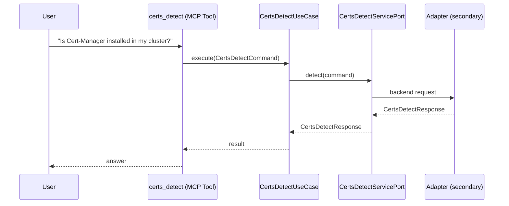

# Use Case 136 — Certs Detect

## Sample Questions

- "Is Cert-Manager installed in my cluster?"
- "How many certificates are expiring soon?"
- "Detect Cert-Manager and show me the certificate counts"
- "Are there any failed certificates in the cluster?"
- "What is the Cert-Manager version and namespace?"

---

"Detect whether cert-manager is installed, its version and namespace, and count certificates that are expiring soon or failed" The user asks via certs_detect. The flow crosses the hexagonal layers: MCP Tool → CertsDetectUseCase → CertsDetectServicePort (driven port) → secondary adapter (via adapter_factory) → cert_manager infrastructure.

### Flow 1 — Certs Detect execution

## Key Points

- `CertsDetectUseCase` depends only on `CertsDetectServicePort` — never on a cloud SDK.
- Adapter selection is by `adapter_factory`, never hardcoded.
- `{slug}` is registered in `mcp/tools/{slug}.py` and synced to the control-plane cache.

## Related Files

- `src/hexawyn/application/ports/driving/certs_detect/certs_detect_service_port.py`
- `src/hexawyn/application/use_case/cert_manager/certs_detect/certs_detect_use_case.py`
- `src/hexawyn/mcp/tools/certs_detect.py`

