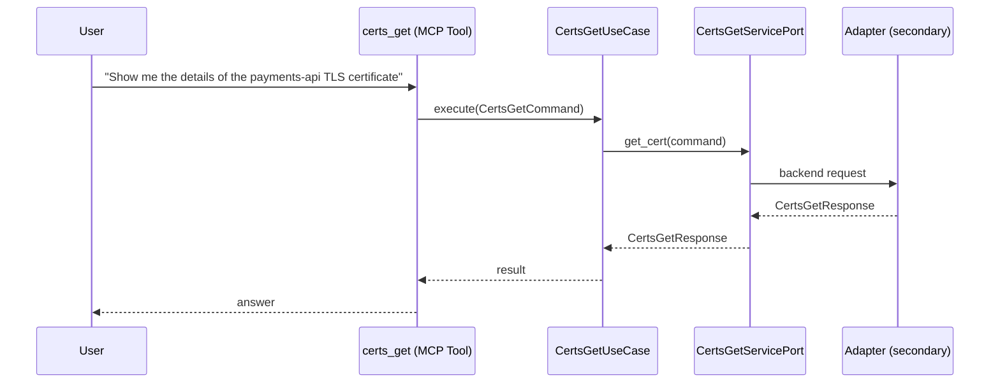

# Use Case 137 — Certs Get

## Sample Questions

- "Show me the details of the payments-api TLS certificate"
- "When does the production wildcard certificate expire?"
- "Is the staging certificate auto-renewing?"
- "What is the issuer type for the frontend certificate?"
- "Get the full status of the auth-service certificate"

---

"Retrieve full details of a specific TLS certificate including expiry date, issuer type, and auto-renewal status" The user asks via certs_get. The flow crosses the hexagonal layers: MCP Tool → CertsGetUseCase → CertsGetServicePort (driven port) → secondary adapter (via adapter_factory) → cert_manager infrastructure.

### Flow 1 — Certs Get execution

## Key Points

- `CertsGetUseCase` depends only on `CertsGetServicePort` — never on a cloud SDK.
- Adapter selection is by `adapter_factory`, never hardcoded.
- `{slug}` is registered in `mcp/tools/{slug}.py` and synced to the control-plane cache.

## Related Files

- `src/hexawyn/application/ports/driving/certs_get/certs_get_service_port.py`
- `src/hexawyn/application/use_case/cert_manager/certs_get/certs_get_use_case.py`
- `src/hexawyn/mcp/tools/certs_get.py`

