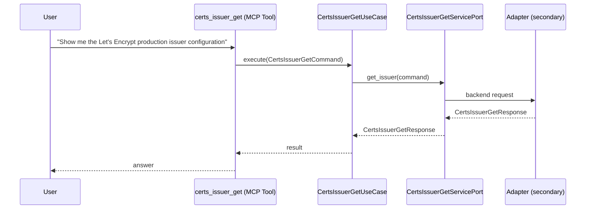

# Use Case 138 — Certs Issuer Get

## Sample Questions

- "Show me the Let's Encrypt production issuer configuration"
- "Is the staging ClusterIssuer ready and connected?"
- "What ACME server is my issuer pointing to?"
- "Why is the Vault issuer not ready?"
- "Get the detail of the self-signed issuer"

---

"Get details of a specific cert-manager Issuer or ClusterIssuer, its ACME server, readiness and why it may not be ready" The user asks via certs_issuer_get. The flow crosses the hexagonal layers: MCP Tool → CertsIssuerGetUseCase → CertsIssuerGetServicePort (driven port) → secondary adapter (via adapter_factory) → cert_manager infrastructure.

### Flow 1 — Certs Issuer Get execution

## Key Points

- `CertsIssuerGetUseCase` depends only on `CertsIssuerGetServicePort` — never on a cloud SDK.
- Adapter selection is by `adapter_factory`, never hardcoded.
- `{slug}` is registered in `mcp/tools/{slug}.py` and synced to the control-plane cache.

## Related Files

- `src/hexawyn/application/ports/driving/certs_issuer_get/certs_issuer_get_service_port.py`
- `src/hexawyn/application/use_case/cert_manager/certs_issuer_get/certs_issuer_get_use_case.py`
- `src/hexawyn/mcp/tools/certs_issuer_get.py`

