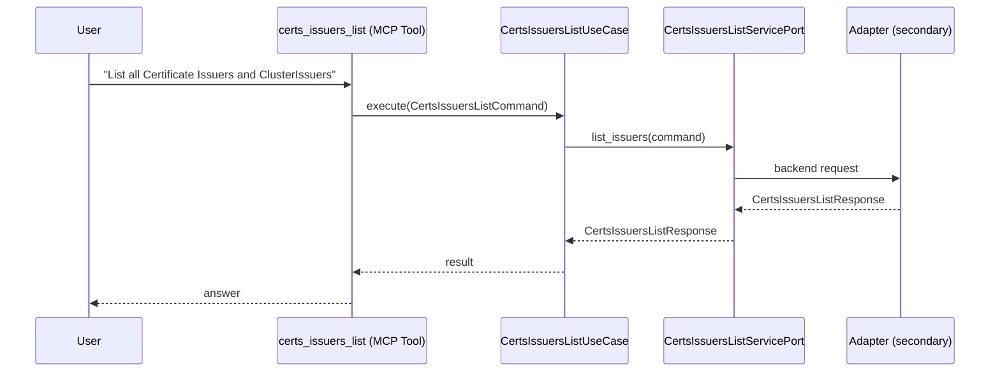

# Use Case 139 — Certs Issuers List

## Sample Questions

- "List all Certificate Issuers and ClusterIssuers"
- "What Let's Encrypt issuers are configured?"
- "Show me all issuers and their readiness status"
- "Are there any self-signed or Vault issuers in my cluster?"
- "Which ClusterIssuers are available cluster-wide?"

---

"List all cert-manager Issuers and ClusterIssuers, their type (Let's Encrypt, Vault, self-signed) and readiness status" The user asks via certs_issuers_list. The flow crosses the hexagonal layers: MCP Tool → CertsIssuersListUseCase → CertsIssuersListServicePort (driven port) → secondary adapter (via adapter_factory) → cert_manager infrastructure.

### Flow 1 — Certs Issuers List execution

## Key Points

- `CertsIssuersListUseCase` depends only on `CertsIssuersListServicePort` — never on a cloud SDK.
- Adapter selection is by `adapter_factory`, never hardcoded.
- `{slug}` is registered in `mcp/tools/{slug}.py` and synced to the control-plane cache.

## Related Files

- `src/hexawyn/application/ports/driving/certs_issuers_list/certs_issuers_list_service_port.py`
- `src/hexawyn/application/use_case/cert_manager/certs_issuers_list/certs_issuers_list_use_case.py`
- `src/hexawyn/mcp/tools/certs_issuers_list.py`

