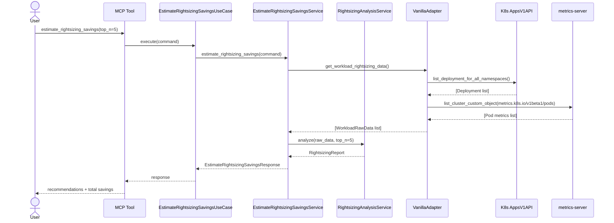
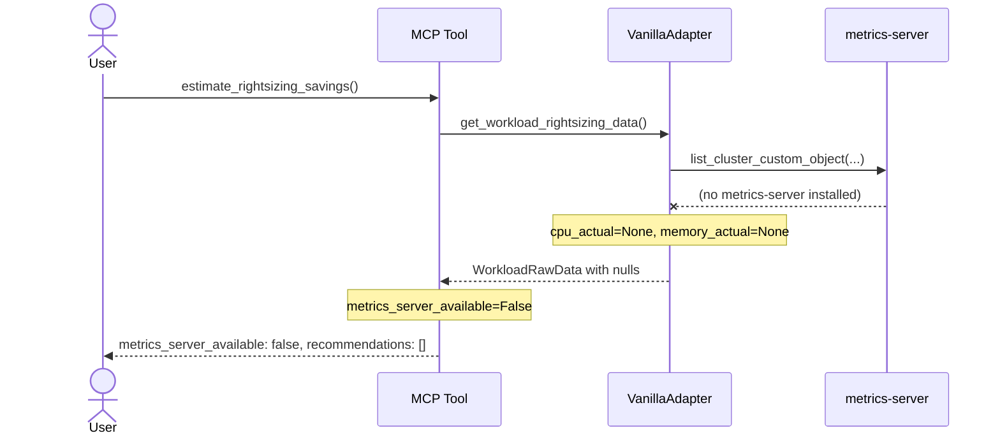
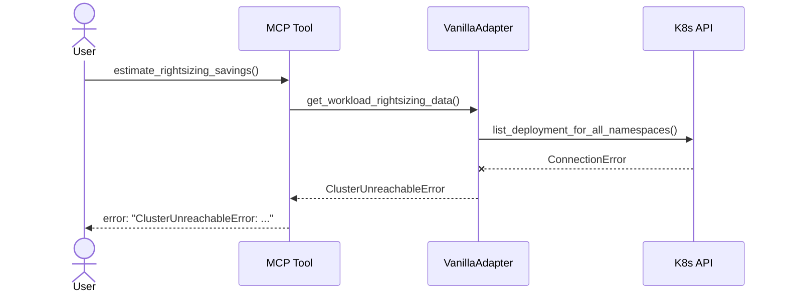
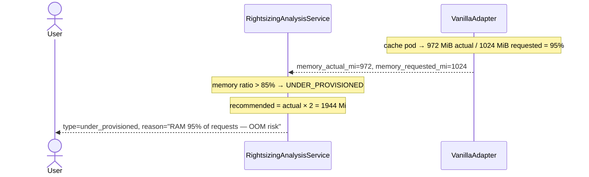

# Use Case 14 — Estimate Rightsizing Savings

## Sample Questions

- "Which of my workloads are over-provisioned and what would I save by rightsizing them?"
- "How much money am I wasting on CPU and memory for my Kubernetes deployments?"
- "Show me the top 5 rightsizing recommendations ranked by monthly savings."
- "My ml-worker pod uses very little CPU — what should I request instead?"
- "Are any of my deployments under-provisioned and at risk of OOM kill?"

---

## Happy Path

---

## metrics-server Unavailable

---

## Cluster Unreachable

---

## Under-Provisioned Detection (OOM Risk)

---

## Key Points

- **Workload data source**: K8s `AppsV1API` (deployments + stateful sets) crossed with metrics-server pod metrics.
- **Pod → workload matching**: Pod names follow `{deployment}-{rs-hash}-{pod-hash}` convention; workload name extracted via `rsplit("-", 2)[0]`.
- **Over-provisioned**: CPU < 30% of requests OR RAM < 40% of requests.
- **Under-provisioned**: RAM > 85% of requests (OOM risk). Always included — no $5 minimum filter.
- **Headroom**: 30% added for over-provisioned recommendations; ×2 for under-provisioned.
- **Pricing**: `$21.6/core/month` and `$2.88/GiB/month` (generic on-demand rates).
- **Priority**: high > $50/mo, medium > $20/mo, low > $5/mo.
- **Savings filter**: Only applied to over-provisioned; workloads below $5/mo savings are skipped and counted in `skipped_count`.

## Test Coverage

| Layer | File |
|-------|------|
| Domain models | `tests/unit/test_rightsizing.py` |
| Domain service | `tests/unit/test_rightsizing_analysis_service.py` |
| Application service + use case | `tests/unit/test_estimate_rightsizing_savings_use_case.py` |
| VanillaAdapter port | `tests/unit/test_vanilla_adapter.py::TestVanillaAdapterRightsizingPort` |
| Integration (real adapter) | `tests/integration/test_estimate_rightsizing_savings_integration.py` |

## Related Files

- `src/hexawyn/domain/models/rightsizing.py`
- `src/hexawyn/domain/services/rightsizing/rightsizing_analysis_service.py`
- `src/hexawyn/application/ports/driven/rightsizing_port.py`
- `src/hexawyn/application/ports/driving/estimate_rightsizing_savings/`
- `src/hexawyn/application/service/estimate_rightsizing_savings_service.py`
- `src/hexawyn/application/use_case/estimate_rightsizing_savings/estimate_rightsizing_savings_use_case.py`
- `src/hexawyn/mcp/tools/estimate_rightsizing_savings.py`
- `src/hexawyn/adapters/secondary/vanilla/vanilla_adapter.py`
