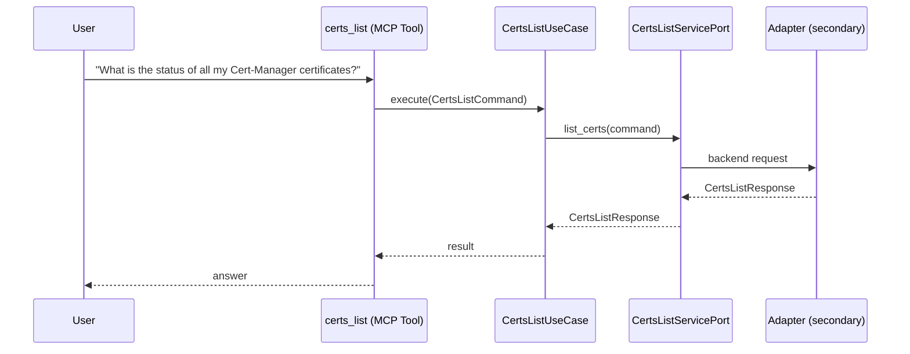

# Use Case 140 — Certs List

## Sample Questions

- "What is the status of all my Cert-Manager certificates?"
- "List all TLS certificates with their expiration dates"
- "Show me which certificates will expire in the next 30 days"
- "Are all my Let's Encrypt certificates valid?"
- "Which certificates are currently not ready or failed?"

---

"List all TLS certificates managed by cert-manager with expiration dates, validity and which ones are not ready or failed" The user asks via certs_list. The flow crosses the hexagonal layers: MCP Tool → CertsListUseCase → CertsListServicePort (driven port) → secondary adapter (via adapter_factory) → cert_manager infrastructure.

### Flow 1 — Certs List execution

## Key Points

- `CertsListUseCase` depends only on `CertsListServicePort` — never on a cloud SDK.
- Adapter selection is by `adapter_factory`, never hardcoded.
- `{slug}` is registered in `mcp/tools/{slug}.py` and synced to the control-plane cache.

## Related Files

- `src/hexawyn/application/ports/driving/certs_list/certs_list_service_port.py`
- `src/hexawyn/application/use_case/cert_manager/certs_list/certs_list_use_case.py`
- `src/hexawyn/mcp/tools/certs_list.py`

