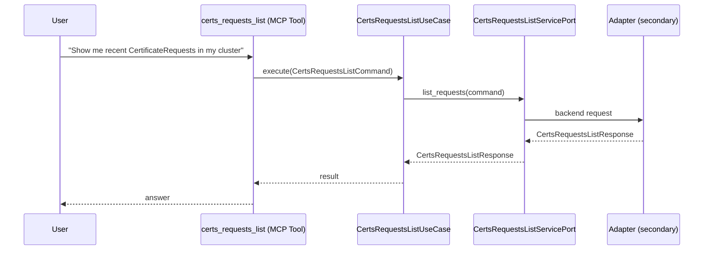

# Use Case 141 — Certs Requests List

## Sample Questions

- "Show me recent CertificateRequests in my cluster"
- "Are there any pending certificate requests?"
- "List all CertificateRequests in the production namespace"
- "What is the status of the latest cert request for staging?"
- "Are any certificate requests failing repeatedly?"

---

"List cert-manager CertificateRequests, showing pending signing requests and those failing repeatedly" The user asks via certs_requests_list. The flow crosses the hexagonal layers: MCP Tool → CertsRequestsListUseCase → CertsRequestsListServicePort (driven port) → secondary adapter (via adapter_factory) → cert_manager infrastructure.

### Flow 1 — Certs Requests List execution

## Key Points

- `CertsRequestsListUseCase` depends only on `CertsRequestsListServicePort` — never on a cloud SDK.
- Adapter selection is by `adapter_factory`, never hardcoded.
- `{slug}` is registered in `mcp/tools/{slug}.py` and synced to the control-plane cache.

## Related Files

- `src/hexawyn/application/ports/driving/certs_requests_list/certs_requests_list_service_port.py`
- `src/hexawyn/application/use_case/cert_manager/certs_requests_list/certs_requests_list_use_case.py`
- `src/hexawyn/mcp/tools/certs_requests_list.py`

