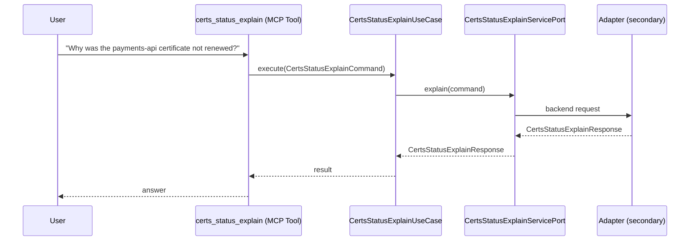

# Use Case 142 — Certs Status Explain

## Sample Questions

- "Why was the payments-api certificate not renewed?"
- "Explain why this TLS certificate is in failed status"
- "What is causing the certificate to not be ready?"
- "Why is my Let's Encrypt certificate stuck in issuing?"
- "What should I do to fix the renewal failure?"

---

"Explain why a cert-manager certificate failed to renew, is stuck in issuing, or is not ready, and how to fix it" The user asks via certs_status_explain. The flow crosses the hexagonal layers: MCP Tool → CertsStatusExplainUseCase → CertsStatusExplainServicePort (driven port) → secondary adapter (via adapter_factory) → cert_manager infrastructure.

### Flow 1 — Certs Status Explain execution

## Key Points

- `CertsStatusExplainUseCase` depends only on `CertsStatusExplainServicePort` — never on a cloud SDK.
- Adapter selection is by `adapter_factory`, never hardcoded.
- `{slug}` is registered in `mcp/tools/{slug}.py` and synced to the control-plane cache.

## Related Files

- `src/hexawyn/application/ports/driving/certs_status_explain/certs_status_explain_service_port.py`
- `src/hexawyn/application/use_case/cert_manager/certs_status_explain/certs_status_explain_use_case.py`
- `src/hexawyn/mcp/tools/certs_status_explain.py`

