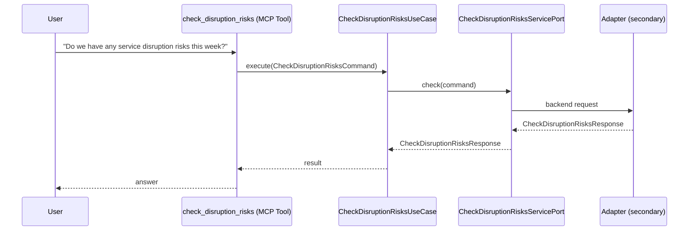

# Use Case 143 — Check Disruption Risks

## Sample Questions

- "Do we have any service disruption risks this week?"
- "Are there upcoming memory saturation or SLO breach risks?"
- "Which services risk an interruption in the next 7 days?"
- "Should I plan an intervention this week to avoid an outage?"
- "Are there any service disruption risks this week?"
- "Are there upcoming memory saturation or SLO breach risks?"
- "Which services are at risk in the next 7 days?"

---

"Predict upcoming service disruption risks in the next 7 days, including memory saturation and SLO breach risks, so an intervention can be planned before an outage" The user asks via check_disruption_risks. The flow crosses the hexagonal layers: MCP Tool → CheckDisruptionRisksUseCase → CheckDisruptionRisksServicePort (driven port) → secondary adapter (via adapter_factory) → cluster infrastructure.

### Flow 1 — Check Disruption Risks execution

## Key Points

- `CheckDisruptionRisksUseCase` depends only on `CheckDisruptionRisksServicePort` — never on a cloud SDK.
- Adapter selection is by `adapter_factory`, never hardcoded.
- `{slug}` is registered in `mcp/tools/{slug}.py` and synced to the control-plane cache.

## Related Files

- `src/hexawyn/application/ports/driving/check_disruption_risks/check_disruption_risks_service_port.py`
- `src/hexawyn/application/use_case/cluster/check_disruption_risks/check_disruption_risks_use_case.py`
- `src/hexawyn/mcp/tools/check_disruption_risks.py`

