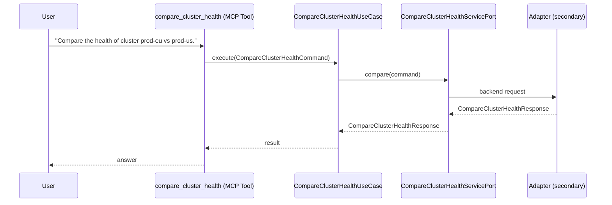

# Use Case 144 — Compare Cluster Health

## Sample Questions

- "Compare the health of cluster prod-eu vs prod-us."
- "Which cluster has more failing pods — EU or US?"
- "Is prod-eu in worse shape than prod-us during this incident?"
- "What are the health deltas between our two production regions?"
- "Which cluster should I investigate first during this multi-region outage?"

---

"Compare the health of two clusters side by side, showing failing pod deltas between regions and which cluster to investigate first during a multi-region outage" The user asks via compare_cluster_health. The flow crosses the hexagonal layers: MCP Tool → CompareClusterHealthUseCase → CompareClusterHealthServicePort (driven port) → secondary adapter (via adapter_factory) → cluster infrastructure.

### Flow 1 — Compare Cluster Health execution

## Key Points

- `CompareClusterHealthUseCase` depends only on `CompareClusterHealthServicePort` — never on a cloud SDK.
- Adapter selection is by `adapter_factory`, never hardcoded.
- `{slug}` is registered in `mcp/tools/{slug}.py` and synced to the control-plane cache.

## Related Files

- `src/hexawyn/application/ports/driving/compare_cluster_health/compare_cluster_health_service_port.py`
- `src/hexawyn/application/use_case/cluster/compare_cluster_health/compare_cluster_health_use_case.py`
- `src/hexawyn/mcp/tools/compare_cluster_health.py`

