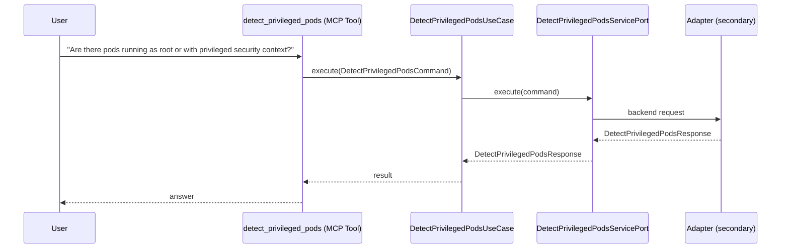

# Use Case 145 — Detect Privileged Pods

## Sample Questions

- "Are there pods running as root or with privileged security context?"
- "Is any container in production running privileged: true?"
- "Which pods are missing a runAsNonRoot setting?"
- "Do any of our containers add dangerous capabilities like SYS_ADMIN?"
- "Which namespaces enforce the restricted Pod Security Standard?"
- "Ignore node-exporter and kube-proxy — what real violations do we have?"

---

"Scan for pods running as root or with a privileged security context, missing runAsNonRoot, dangerous capabilities like SYS_ADMIN, and Pod Security Standard violations" The user asks via detect_privileged_pods. The flow crosses the hexagonal layers: MCP Tool → DetectPrivilegedPodsUseCase → DetectPrivilegedPodsServicePort (driven port) → secondary adapter (via adapter_factory) → security infrastructure.

### Flow 1 — Detect Privileged Pods execution

## Key Points

- `DetectPrivilegedPodsUseCase` depends only on `DetectPrivilegedPodsServicePort` — never on a cloud SDK.
- Adapter selection is by `adapter_factory`, never hardcoded.
- `{slug}` is registered in `mcp/tools/{slug}.py` and synced to the control-plane cache.

## Related Files

- `src/hexawyn/application/ports/driving/detect_privileged_pods/detect_privileged_pods_service_port.py`
- `src/hexawyn/application/use_case/security/detect_privileged_pods/detect_privileged_pods_use_case.py`
- `src/hexawyn/mcp/tools/detect_privileged_pods.py`

