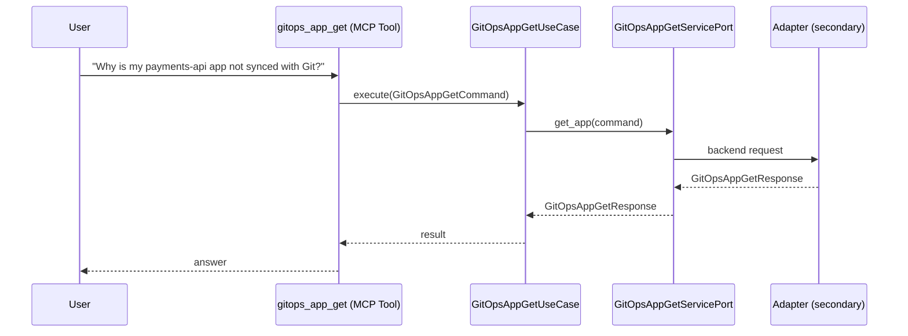

# Use Case 146 — Gitops App Get

## Sample Questions

- "Why is my payments-api app not synced with Git?"
- "Get the full status of the payments-api HelmRelease"
- "What is the last commit deployed for the auth-service Application?"
- "Show me the details of the frontend application in Argo CD"
- "Why is my Kustomization failing to reconcile?"

---

"Get the full status of a GitOps Application, HelmRelease or Kustomization, why it is not synced with Git, and its last deployed commit" The user asks via gitops_app_get. The flow crosses the hexagonal layers: MCP Tool → GitOpsAppGetUseCase → GitOpsAppGetServicePort (driven port) → secondary adapter (via adapter_factory) → gitops infrastructure.

### Flow 1 — Gitops App Get execution

## Key Points

- `GitOpsAppGetUseCase` depends only on `GitOpsAppGetServicePort` — never on a cloud SDK.
- Adapter selection is by `adapter_factory`, never hardcoded.
- `{slug}` is registered in `mcp/tools/{slug}.py` and synced to the control-plane cache.

## Related Files

- `src/hexawyn/application/ports/driving/gitops_app_get/gitops_app_get_service_port.py`
- `src/hexawyn/application/use_case/gitops/gitops_app_get/gitops_app_get_use_case.py`
- `src/hexawyn/mcp/tools/gitops_app_get.py`

