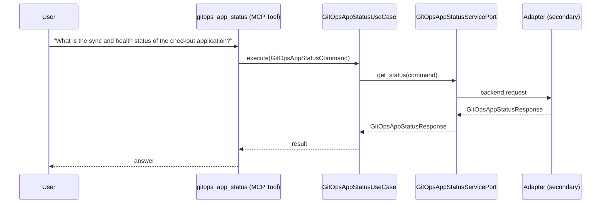

# Use Case 147 — Gitops App Status

## Sample Questions

- "What is the sync and health status of the checkout application?"
- "Is the payments-service healthy according to Flux?"
- "Show me the reconciliation status of the prod-deploy Application"
- "When was the last time the staging Kustomization synced?"
- "Give me the health and sync status of the auth-api HelmRelease"

---

"Get the sync and health status of a GitOps application and its last reconciliation time, whether it is healthy according to Flux or Argo CD" The user asks via gitops_app_status. The flow crosses the hexagonal layers: MCP Tool → GitOpsAppStatusUseCase → GitOpsAppStatusServicePort (driven port) → secondary adapter (via adapter_factory) → gitops infrastructure.

### Flow 1 — Gitops App Status execution

## Key Points

- `GitOpsAppStatusUseCase` depends only on `GitOpsAppStatusServicePort` — never on a cloud SDK.
- Adapter selection is by `adapter_factory`, never hardcoded.
- `{slug}` is registered in `mcp/tools/{slug}.py` and synced to the control-plane cache.

## Related Files

- `src/hexawyn/application/ports/driving/gitops_app_status/gitops_app_status_service_port.py`
- `src/hexawyn/application/use_case/gitops/gitops_app_status/gitops_app_status_use_case.py`
- `src/hexawyn/mcp/tools/gitops_app_status.py`

