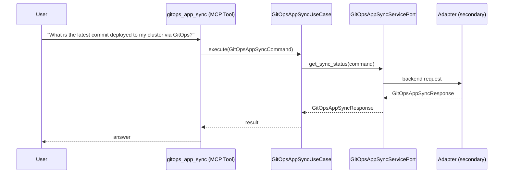

# Use Case 148 — Gitops App Sync

## Sample Questions

- "What is the latest commit deployed to my cluster via GitOps?"
- "What is the current revision deployed for the api-gateway?"
- "When was the last sync of the production HelmRelease?"
- "Is the payments-api in sync with the latest Git commit?"
- "Show me the deployed revision for the checkout-service"

---

"Get the deployed revision or latest commit a GitOps app synced to and whether it is in sync with the latest Git commit" The user asks via gitops_app_sync. The flow crosses the hexagonal layers: MCP Tool → GitOpsAppSyncUseCase → GitOpsAppSyncServicePort (driven port) → secondary adapter (via adapter_factory) → gitops infrastructure.

### Flow 1 — Gitops App Sync execution

## Key Points

- `GitOpsAppSyncUseCase` depends only on `GitOpsAppSyncServicePort` — never on a cloud SDK.
- Adapter selection is by `adapter_factory`, never hardcoded.
- `{slug}` is registered in `mcp/tools/{slug}.py` and synced to the control-plane cache.

## Related Files

- `src/hexawyn/application/ports/driving/gitops_app_sync/gitops_app_sync_service_port.py`
- `src/hexawyn/application/use_case/gitops/gitops_app_sync/gitops_app_sync_use_case.py`
- `src/hexawyn/mcp/tools/gitops_app_sync.py`

