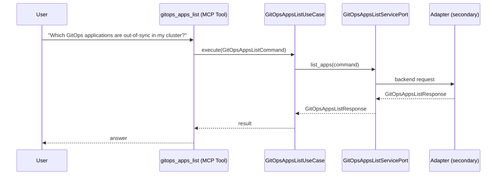

# Use Case 149 — Gitops Apps List

## Sample Questions

- "Which GitOps applications are out-of-sync in my cluster?"
- "List all Flux HelmReleases and Kustomizations in the flux-system namespace"
- "Show me the status of all my Argo CD applications"
- "Are there any GitOps applications currently in error?"
- "Which Argo CD applications are currently degraded or missing?"

---

"List all GitOps applications, HelmReleases and Kustomizations, which are out-of-sync, degraded, missing or in error across Flux and Argo CD" The user asks via gitops_apps_list. The flow crosses the hexagonal layers: MCP Tool → GitOpsAppsListUseCase → GitOpsAppsListServicePort (driven port) → secondary adapter (via adapter_factory) → gitops infrastructure.

### Flow 1 — Gitops Apps List execution

## Key Points

- `GitOpsAppsListUseCase` depends only on `GitOpsAppsListServicePort` — never on a cloud SDK.
- Adapter selection is by `adapter_factory`, never hardcoded.
- `{slug}` is registered in `mcp/tools/{slug}.py` and synced to the control-plane cache.

## Related Files

- `src/hexawyn/application/ports/driving/gitops_apps_list/gitops_apps_list_service_port.py`
- `src/hexawyn/application/use_case/gitops/gitops_apps_list/gitops_apps_list_use_case.py`
- `src/hexawyn/mcp/tools/gitops_apps_list.py`

