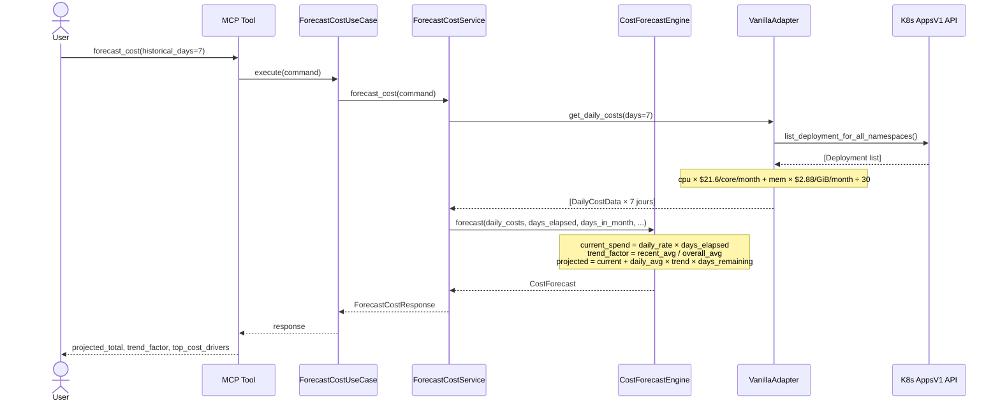
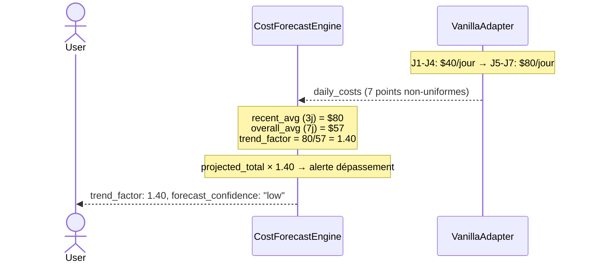
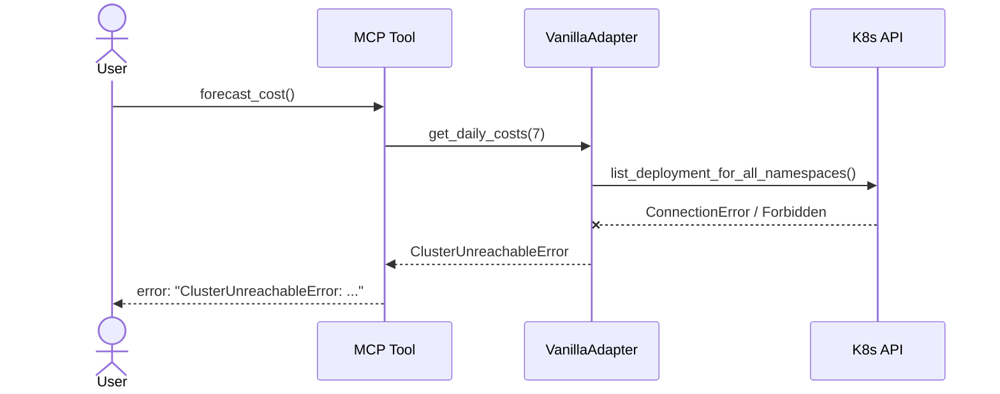
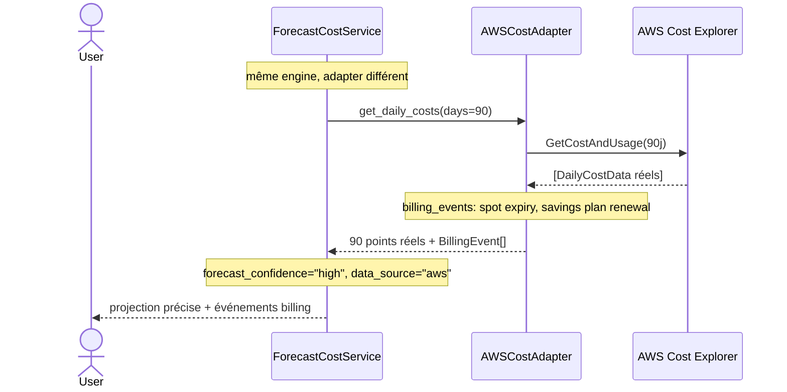

# Use Case 15 — Forecast Cost (Cost Predictive Model)

## Sample Questions

- "Combien vais-je dépenser ce mois en tout sur mon cluster Kubernetes ?"
- "Est-ce que mon spend accélère par rapport aux semaines précédentes ?"
- "Quels sont les 3 namespaces qui coûtent le plus cher ce mois-ci ?"
- "Mon budget mensuel est $2,000 — est-ce que je vais le dépasser ?"
- "Quelle est la tendance de mon spend Cloud par rapport au mois dernier ?"

---

## Happy Path

---

## Détection d'accélération (trend > 1.0)

---

## Cluster Unreachable

---

## Pro Tier — Billing Réel (ECA-115, post v1.0)

---

## Key Points

- **Formule Free** : `daily_rate = resource_requests × pricing_constants / 30` — même constantes que le rightsizing (`$21.6/core/month`, `$2.88/GiB/month`).
- **Tendance** : `trend_factor = avg(3 derniers jours) / avg(global)`. Fenêtre glissante de 3 jours.
- **Free tier** : 7 jours d'historique estimé, tous identiques → `trend_factor = 1.0`, `confidence = "low"`.
- **Projection** : `projected = current_spend + daily_avg × trend_factor × days_remaining`.
- **Top drivers** : namespaces triés par coût journalier agrégé, convertis en coût mensuel estimé.
- **`previous_month_usd`** : `None` en Free (pas d'historique réel). Delta MoM = 0% par défaut.
- **Même engine** pour Free et Pro — seule la qualité des données de l'adapter change.

## Test Coverage

| Layer | Fichier |
|-------|---------|
| Domain models | `tests/unit/test_cost_forecast_models.py` |
| Domain service | `tests/unit/test_cost_forecast_engine.py` |
| Port + app service + use case | `tests/unit/test_forecast_cost_port_and_service.py` |
| MCP tool + VanillaAdapter | `tests/unit/test_forecast_cost_mcp_and_adapter.py` |
| Integration (real adapter) | `tests/integration/test_forecast_cost_integration.py` |

## Related Files

- `src/hexawyn/domain/models/cost_forecast.py`
- `src/hexawyn/domain/services/cost_forecast/cost_forecast_engine.py`
- `src/hexawyn/application/ports/driven/cost_forecast_port.py`
- `src/hexawyn/application/ports/driving/forecast_cost/`
- `src/hexawyn/application/service/forecast_cost_service.py`
- `src/hexawyn/application/use_case/forecast_cost/forecast_cost_use_case.py`
- `src/hexawyn/mcp/tools/forecast_cost.py`
- `src/hexawyn/adapters/secondary/vanilla/vanilla_adapter.py`
