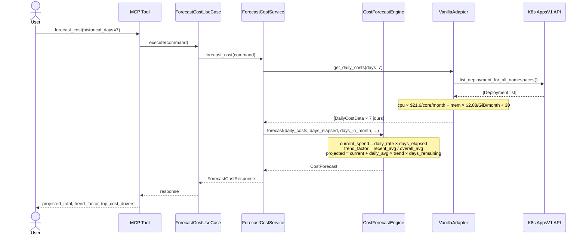
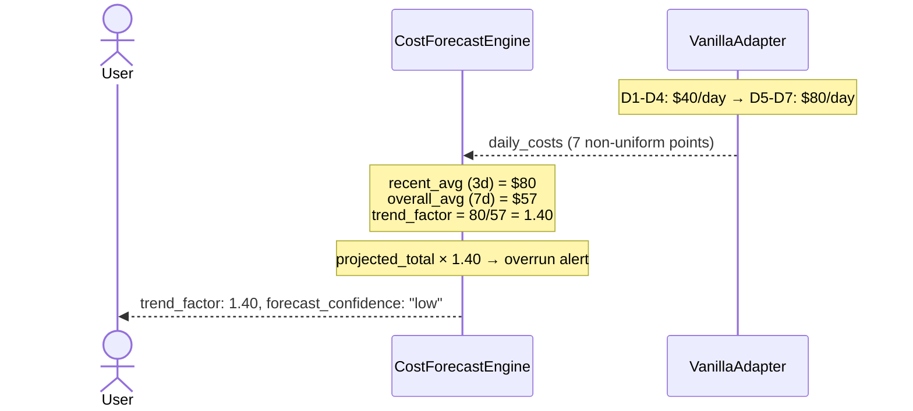
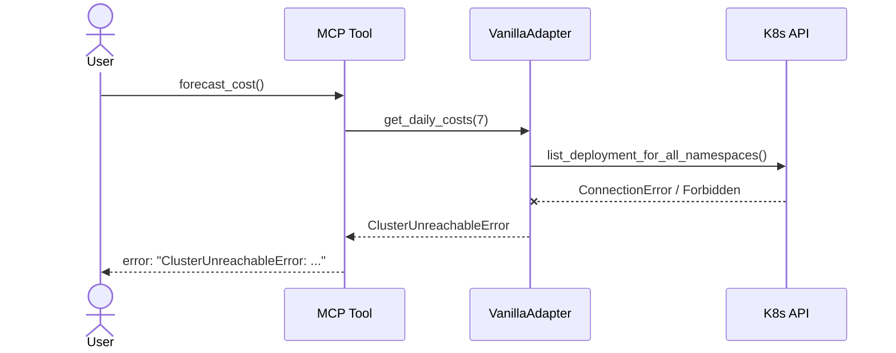
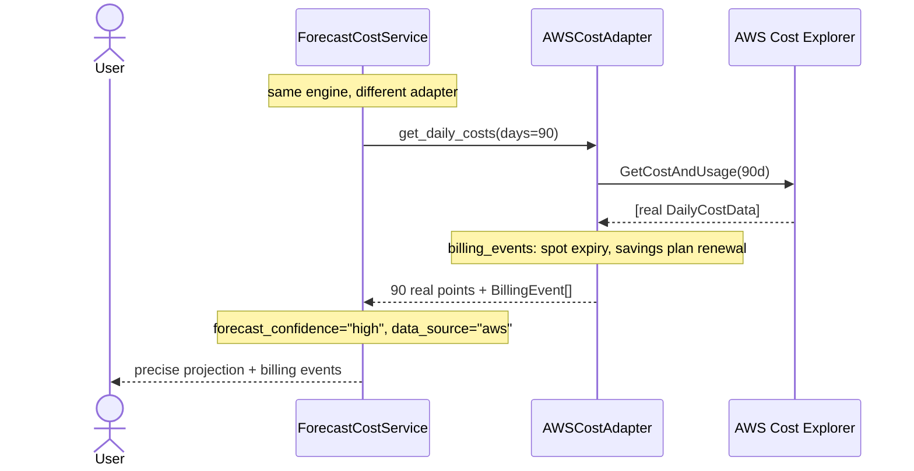

# Use Case 15 — Forecast Cost (Cost Predictive Model)

## Sample Questions

- "How much will I spend this month in total on my Kubernetes cluster?"
- "Is my spend accelerating compared to previous weeks?"
- "Which are the 3 most expensive namespaces this month?"
- "My monthly budget is $2,000 — am I going to exceed it?"
- "What is my Cloud spend trend compared to last month?"

---

## Happy Path

---

## Acceleration Detection (trend > 1.0)

---

## Cluster Unreachable

---

## Pro Tier — Real Billing (ECA-115, post v1.0)

---

## Key Points

- **Free formula**: `daily_rate = resource_requests × pricing_constants / 30` — same constants as rightsizing (`$21.6/core/month`, `$2.88/GiB/month`).
- **Trend**: `trend_factor = avg(last 3 days) / avg(overall)`. 3-day sliding window.
- **Free tier**: 7 days of estimated history, all identical → `trend_factor = 1.0`, `confidence = "low"`.
- **Projection**: `projected = current_spend + daily_avg × trend_factor × days_remaining`.
- **Top drivers**: namespaces sorted by aggregated daily cost, converted to estimated monthly cost.
- **`previous_month_usd`**: `None` on Free (no real history). MoM delta = 0% by default.
- **Same engine** for Free and Pro — only the adapter's data quality changes.

## Test Coverage

| Layer | File |
|-------|---------|
| Domain models | `tests/unit/test_cost_forecast_models.py` |
| Domain service | `tests/unit/test_cost_forecast_engine.py` |
| Port + app service + use case | `tests/unit/test_forecast_cost_port_and_service.py` |
| MCP tool + VanillaAdapter | `tests/unit/test_forecast_cost_mcp_and_adapter.py` |
| Integration (real adapter) | `tests/integration/test_forecast_cost_integration.py` |

## Related Files

- `src/hexawyn/domain/models/cost_forecast.py`
- `src/hexawyn/domain/services/cost_forecast/cost_forecast_engine.py`
- `src/hexawyn/application/ports/driven/cost_forecast_port.py`
- `src/hexawyn/application/ports/driving/forecast_cost/`
- `src/hexawyn/application/service/forecast_cost_service.py`
- `src/hexawyn/application/use_case/forecast_cost/forecast_cost_use_case.py`
- `src/hexawyn/mcp/tools/forecast_cost.py`
- `src/hexawyn/adapters/secondary/vanilla/vanilla_adapter.py`
