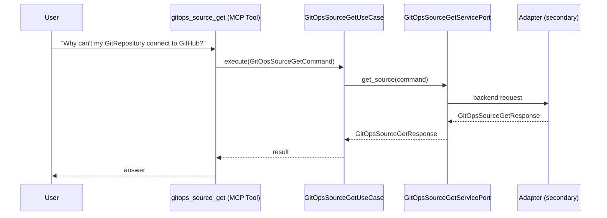

# Use Case 150 — Gitops Source Get

## Sample Questions

- "Why can't my GitRepository connect to GitHub?"
- "Get the connection status of the prod-manifests GitRepository"
- "What is the URL and last-updated time of the helm-charts HelmRepository?"
- "Is the main GitRepository authenticated and ready?"
- "What's the error message on the staging HelmRepository?"

---

"Get the connection status of a GitOps GitRepository or HelmRepository source, why it can't reach GitHub, its URL, auth and error message" The user asks via gitops_source_get. The flow crosses the hexagonal layers: MCP Tool → GitOpsSourceGetUseCase → GitOpsSourceGetServicePort (driven port) → secondary adapter (via adapter_factory) → gitops infrastructure.

### Flow 1 — Gitops Source Get execution

## Key Points

- `GitOpsSourceGetUseCase` depends only on `GitOpsSourceGetServicePort` — never on a cloud SDK.
- Adapter selection is by `adapter_factory`, never hardcoded.
- `{slug}` is registered in `mcp/tools/{slug}.py` and synced to the control-plane cache.

## Related Files

- `src/hexawyn/application/ports/driving/gitops_source_get/gitops_source_get_service_port.py`
- `src/hexawyn/application/use_case/gitops/gitops_source_get/gitops_source_get_use_case.py`
- `src/hexawyn/mcp/tools/gitops_source_get.py`

