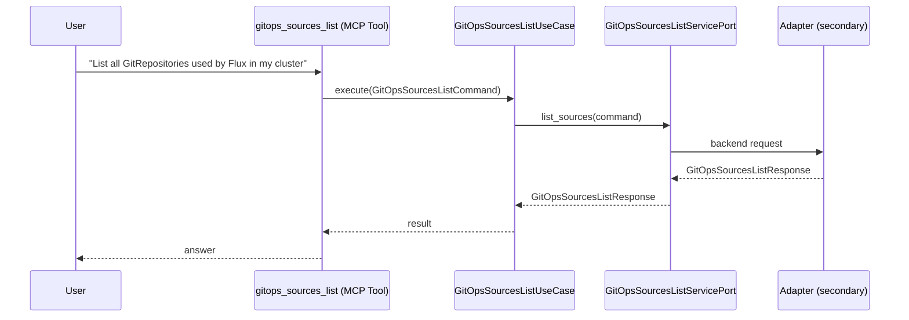

# Use Case 151 — Gitops Sources List

## Sample Questions

- "List all GitRepositories used by Flux in my cluster"
- "What GitOps sources are configured?"
- "Which Helm repositories are currently unreachable?"
- "Show me all sources in the flux-system namespace and their ready status"
- "Are all my GitRepositories healthy and connected?"

---

"List all GitOps sources — GitRepositories and HelmRepositories used by Flux — with their ready status and any unreachable repositories" The user asks via gitops_sources_list. The flow crosses the hexagonal layers: MCP Tool → GitOpsSourcesListUseCase → GitOpsSourcesListServicePort (driven port) → secondary adapter (via adapter_factory) → gitops infrastructure.

### Flow 1 — Gitops Sources List execution

## Key Points

- `GitOpsSourcesListUseCase` depends only on `GitOpsSourcesListServicePort` — never on a cloud SDK.
- Adapter selection is by `adapter_factory`, never hardcoded.
- `{slug}` is registered in `mcp/tools/{slug}.py` and synced to the control-plane cache.

## Related Files

- `src/hexawyn/application/ports/driving/gitops_sources_list/gitops_sources_list_service_port.py`
- `src/hexawyn/application/use_case/gitops/gitops_sources_list/gitops_sources_list_use_case.py`
- `src/hexawyn/mcp/tools/gitops_sources_list.py`

