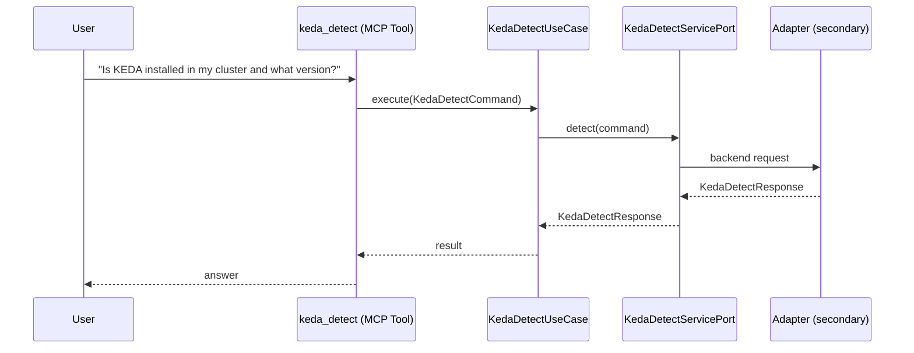

# Use Case 152 — Keda Detect

## Sample Questions

- "Is KEDA installed in my cluster and what version?"
- "How many ScaledObjects does KEDA manage across all namespaces?"
- "Detect KEDA and show me the managed namespaces"
- "Are there any ScaledObjects in error right now?"
- "How many ScaledJobs and ScaledObjects are configured via KEDA?"

---

"Detect whether KEDA is installed and its version, how many ScaledObjects and ScaledJobs it manages across namespaces" The user asks via keda_detect. The flow crosses the hexagonal layers: MCP Tool → KedaDetectUseCase → KedaDetectServicePort (driven port) → secondary adapter (via adapter_factory) → keda infrastructure.

### Flow 1 — Keda Detect execution

## Key Points

- `KedaDetectUseCase` depends only on `KedaDetectServicePort` — never on a cloud SDK.
- Adapter selection is by `adapter_factory`, never hardcoded.
- `{slug}` is registered in `mcp/tools/{slug}.py` and synced to the control-plane cache.

## Related Files

- `src/hexawyn/application/ports/driving/keda_detect/keda_detect_service_port.py`
- `src/hexawyn/application/use_case/keda/keda_detect/keda_detect_use_case.py`
- `src/hexawyn/mcp/tools/keda_detect.py`

