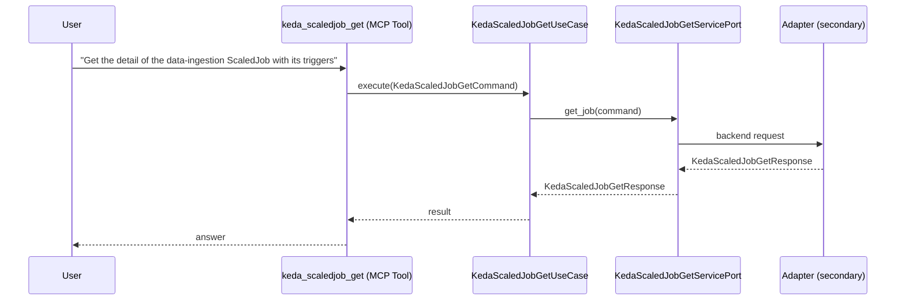

# Use Case 153 — Keda Scaledjob Get

## Sample Questions

- "Get the detail of the data-ingestion ScaledJob with its triggers"
- "How many times has the nightly-batch ScaledJob failed vs succeeded?"
- "What is the cooldown and max replica count for the image-processor ScaledJob?"
- "When was the last time the cleanup-job ScaledJob executed?"
- "Why is the report-generator ScaledJob in error?"

---

"Get details of a specific KEDA ScaledJob, its triggers, cooldown, max replicas, success versus failure counts, and last execution time" The user asks via keda_scaledjob_get. The flow crosses the hexagonal layers: MCP Tool → KedaScaledJobGetUseCase → KedaScaledJobGetServicePort (driven port) → secondary adapter (via adapter_factory) → keda infrastructure.

### Flow 1 — Keda Scaledjob Get execution

## Key Points

- `KedaScaledJobGetUseCase` depends only on `KedaScaledJobGetServicePort` — never on a cloud SDK.
- Adapter selection is by `adapter_factory`, never hardcoded.
- `{slug}` is registered in `mcp/tools/{slug}.py` and synced to the control-plane cache.

## Related Files

- `src/hexawyn/application/ports/driving/keda_scaledjob_get/keda_scaledjob_get_service_port.py`
- `src/hexawyn/application/use_case/keda/keda_scaledjob_get/keda_scaledjob_get_use_case.py`
- `src/hexawyn/mcp/tools/keda_scaledjob_get.py`

