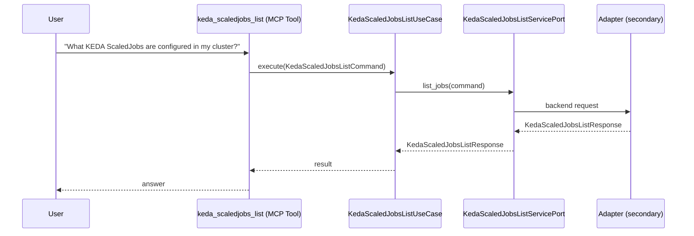

# Use Case 154 — Keda Scaledjobs List

## Sample Questions

- "What KEDA ScaledJobs are configured in my cluster?"
- "Did my ScaledJob batch-processing run successfully last night?"
- "Are there any ScaledJobs currently in error?"
- "List all ScaledJobs with their execution counters and last run time"
- "Which ScaledJobs are paused vs active?"

---

"List KEDA ScaledJobs with execution counters and last run time, which ran successfully last night, which are in error, and which are paused versus active" The user asks via keda_scaledjobs_list. The flow crosses the hexagonal layers: MCP Tool → KedaScaledJobsListUseCase → KedaScaledJobsListServicePort (driven port) → secondary adapter (via adapter_factory) → keda infrastructure.

### Flow 1 — Keda Scaledjobs List execution

## Key Points

- `KedaScaledJobsListUseCase` depends only on `KedaScaledJobsListServicePort` — never on a cloud SDK.
- Adapter selection is by `adapter_factory`, never hardcoded.
- `{slug}` is registered in `mcp/tools/{slug}.py` and synced to the control-plane cache.

## Related Files

- `src/hexawyn/application/ports/driving/keda_scaledjobs_list/keda_scaledjobs_list_service_port.py`
- `src/hexawyn/application/use_case/keda/keda_scaledjobs_list/keda_scaledjobs_list_use_case.py`
- `src/hexawyn/mcp/tools/keda_scaledjobs_list.py`

