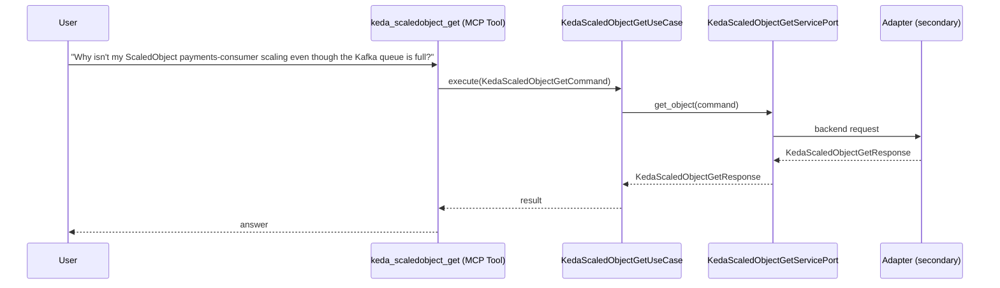

# Use Case 155 — Keda Scaledobject Get

## Sample Questions

- "Why isn't my ScaledObject payments-consumer scaling even though the Kafka queue is full?"
- "Get the full detail of the auth-service ScaledObject with all triggers"
- "What triggers are configured on the order-processor ScaledObject?"
- "Show me the cooldown and fallback config for the checkout ScaledObject"
- "What workload does the api-worker ScaledObject control?"

---

"Get a KEDA ScaledObject's full detail, its triggers, cooldown and fallback config, which workload it controls, and why it isn't scaling despite a full queue" The user asks via keda_scaledobject_get. The flow crosses the hexagonal layers: MCP Tool → KedaScaledObjectGetUseCase → KedaScaledObjectGetServicePort (driven port) → secondary adapter (via adapter_factory) → keda infrastructure.

### Flow 1 — Keda Scaledobject Get execution

## Key Points

- `KedaScaledObjectGetUseCase` depends only on `KedaScaledObjectGetServicePort` — never on a cloud SDK.
- Adapter selection is by `adapter_factory`, never hardcoded.
- `{slug}` is registered in `mcp/tools/{slug}.py` and synced to the control-plane cache.

## Related Files

- `src/hexawyn/application/ports/driving/keda_scaledobject_get/keda_scaledobject_get_service_port.py`
- `src/hexawyn/application/use_case/keda/keda_scaledobject_get/keda_scaledobject_get_use_case.py`
- `src/hexawyn/mcp/tools/keda_scaledobject_get.py`

