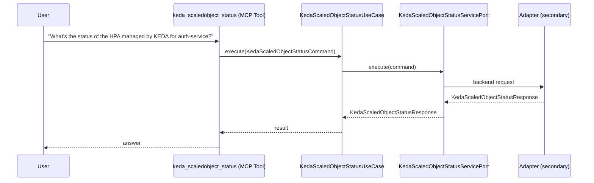

# Use Case 156 — Keda Scaledobject Status

## Sample Questions

- "What's the status of the HPA managed by KEDA for auth-service?"
- "Is the payments-consumer currently scaling or in cooldown?"
- "What are the current vs target replicas for the checkout ScaledObject?"
- "When was the last time the notification-worker scaled?"
- "Show me the real-time HPA status for the production ScaledObject"

---

"Get the real-time status of the HPA managed by KEDA for a ScaledObject, current versus target replicas, whether it is scaling or in cooldown, and its last scale time" The user asks via keda_scaledobject_status. The flow crosses the hexagonal layers: MCP Tool → KedaScaledObjectStatusUseCase → KedaScaledObjectStatusServicePort (driven port) → secondary adapter (via adapter_factory) → keda infrastructure.

### Flow 1 — Keda Scaledobject Status execution

## Key Points

- `KedaScaledObjectStatusUseCase` depends only on `KedaScaledObjectStatusServicePort` — never on a cloud SDK.
- Adapter selection is by `adapter_factory`, never hardcoded.
- `{slug}` is registered in `mcp/tools/{slug}.py` and synced to the control-plane cache.

## Related Files

- `src/hexawyn/application/ports/driving/keda_scaledobject_status/keda_scaledobject_status_service_port.py`
- `src/hexawyn/application/use_case/keda/keda_scaledobject_status/keda_scaledobject_status_use_case.py`
- `src/hexawyn/mcp/tools/keda_scaledobject_status.py`

