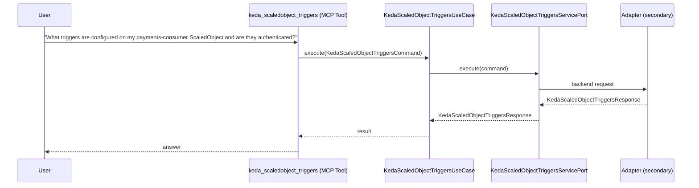

# Use Case 157 — Keda Scaledobject Triggers

## Sample Questions

- "What triggers are configured on my payments-consumer ScaledObject and are they authenticated?"
- "Are there any KEDA triggers with broken authentication?"
- "List all Kafka triggers with their auth status on the production ScaledObject"
- "Which Prometheus queries are used by KEDA triggers in my cluster?"
- "Show me the cron schedule for all KEDA cron triggers"

---

"Inspect a KEDA ScaledObject's triggers and their authentication status, Kafka and Prometheus triggers, cron schedules, and any triggers with broken auth" The user asks via keda_scaledobject_triggers. The flow crosses the hexagonal layers: MCP Tool → KedaScaledObjectTriggersUseCase → KedaScaledObjectTriggersServicePort (driven port) → secondary adapter (via adapter_factory) → keda infrastructure.

### Flow 1 — Keda Scaledobject Triggers execution

## Key Points

- `KedaScaledObjectTriggersUseCase` depends only on `KedaScaledObjectTriggersServicePort` — never on a cloud SDK.
- Adapter selection is by `adapter_factory`, never hardcoded.
- `{slug}` is registered in `mcp/tools/{slug}.py` and synced to the control-plane cache.

## Related Files

- `src/hexawyn/application/ports/driving/keda_scaledobject_triggers/keda_scaledobject_triggers_service_port.py`
- `src/hexawyn/application/use_case/keda/keda_scaledobject_triggers/keda_scaledobject_triggers_use_case.py`
- `src/hexawyn/mcp/tools/keda_scaledobject_triggers.py`

