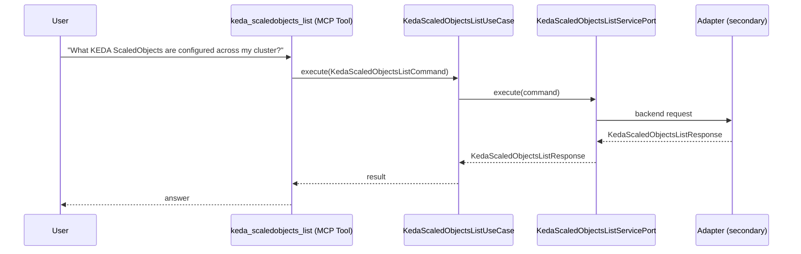

# Use Case 158 — Keda Scaledobjects List

## Sample Questions

- "What KEDA ScaledObjects are configured across my cluster?"
- "List all ScaledObjects with their triggers and HPA status"
- "Show me which workloads are configured for KEDA autoscaling"
- "How many ScaledObjects manage our production vs staging clusters?"
- "List all KEDA ScaledObjects in the payments namespace"

---

"List KEDA ScaledObjects across the cluster with their triggers and HPA status, which workloads use KEDA autoscaling, and per-namespace counts" The user asks via keda_scaledobjects_list. The flow crosses the hexagonal layers: MCP Tool → KedaScaledObjectsListUseCase → KedaScaledObjectsListServicePort (driven port) → secondary adapter (via adapter_factory) → keda infrastructure.

### Flow 1 — Keda Scaledobjects List execution

## Key Points

- `KedaScaledObjectsListUseCase` depends only on `KedaScaledObjectsListServicePort` — never on a cloud SDK.
- Adapter selection is by `adapter_factory`, never hardcoded.
- `{slug}` is registered in `mcp/tools/{slug}.py` and synced to the control-plane cache.

## Related Files

- `src/hexawyn/application/ports/driving/keda_scaledobjects_list/keda_scaledobjects_list_service_port.py`
- `src/hexawyn/application/use_case/keda/keda_scaledobjects_list/keda_scaledobjects_list_use_case.py`
- `src/hexawyn/mcp/tools/keda_scaledobjects_list.py`

