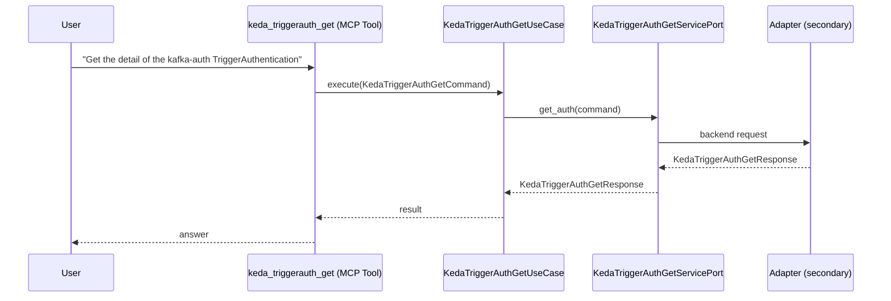

# Use Case 159 — Keda Triggerauth Get

## Sample Questions

- "Get the detail of the kafka-auth TriggerAuthentication"
- "What authentication type does the prometheus-auth use?"
- "Is the production TriggerAuthentication ready?"
- "Show me which secrets the keda-auth references (without values)"
- "What pod identity provider does the cluster trigger auth use?"

---

"Get the detail of a KEDA TriggerAuthentication — its authentication type, referenced secrets without values, pod identity provider, and readiness. This is the agnostic KEDA auth tool; prefer it for generic queries unless the query explicitly mentions AWS, Azure, GCP, IRSA, or Workload Identity." The user asks via keda_triggerauth_get. The flow crosses the hexagonal layers: MCP Tool → KedaTriggerAuthGetUseCase → KedaTriggerAuthGetServicePort (driven port) → secondary adapter (via adapter_factory) → keda infrastructure.

### Flow 1 — Keda Triggerauth Get execution

## Key Points

- `KedaTriggerAuthGetUseCase` depends only on `KedaTriggerAuthGetServicePort` — never on a cloud SDK.
- Adapter selection is by `adapter_factory`, never hardcoded.
- `{slug}` is registered in `mcp/tools/{slug}.py` and synced to the control-plane cache.

## Related Files

- `src/hexawyn/application/ports/driving/keda_triggerauth_get/keda_triggerauth_get_service_port.py`
- `src/hexawyn/application/use_case/keda/keda_triggerauth_get/keda_triggerauth_get_use_case.py`
- `src/hexawyn/mcp/tools/keda_triggerauth_get.py`

