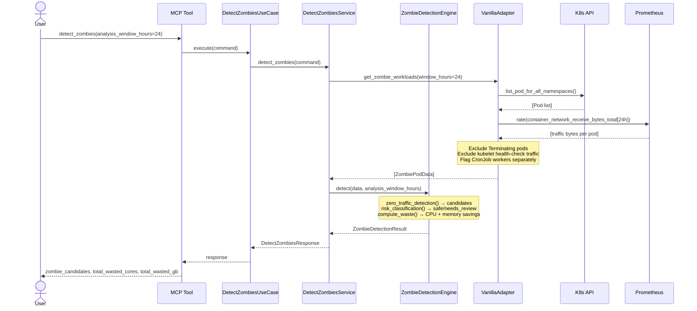
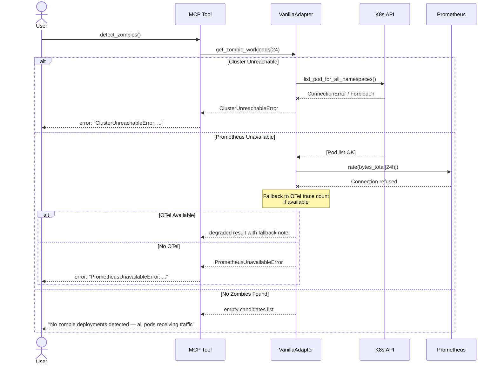
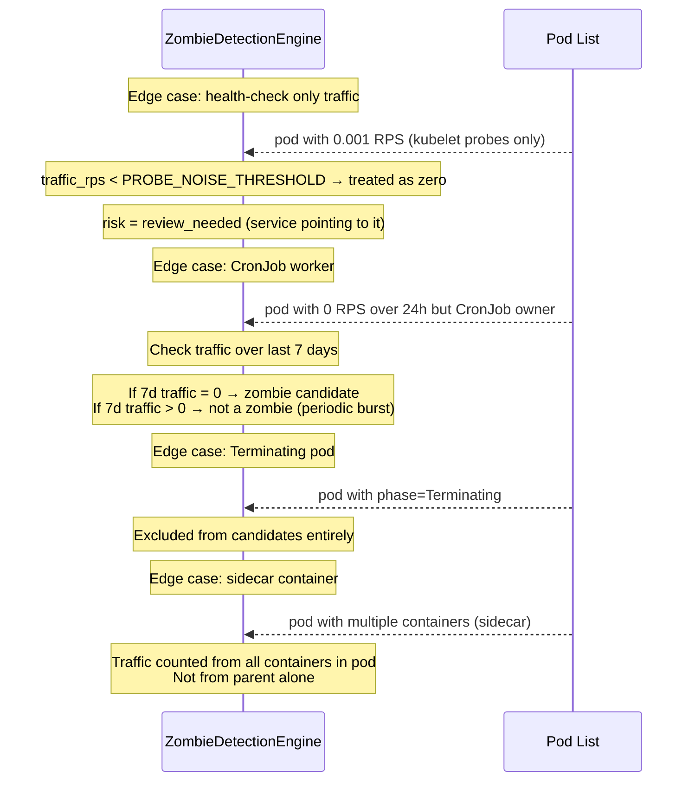
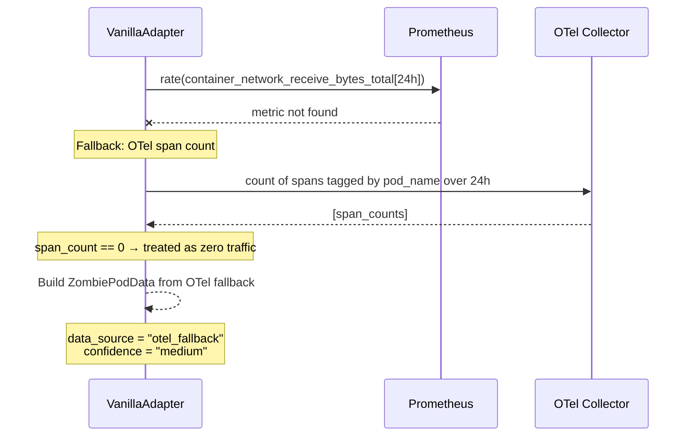

# Use Case 16 — Detect Zombie Deployments (Idle Pod Detection)

## Sample Questions

- "Which pods have been running with 0 traffic for the last 24 hours — are there zombie deployments we can safely remove?"
- "Can you list all pods that received no network traffic in the last day?"
- "Are there any zombie workloads wasting compute resources in my cluster?"
- "How much money would I save by removing idle pods from production?"
- "Show me pods with zero RPS — flag the ones safe to decommission."

---

## Happy Path

---

## Error Flows

---

## Health-Check Filtering & Edge Cases

---

## Prometheus Fallback — OTel Trace Count

---

## Key Points

- **Zero traffic detection** : `rate(container_network_receive_bytes_total[24h]) == 0` on Prometheus. Fallback to OTel span count if Prometheus metric missing.
- **Health-check filtering** : kubelet probe traffic (very low bytes, no user-facing RPS) is excluded via `_is_probe_traffic()` heuristic.
- **Risk classification** : `safe_to_remove` = no traffic + no Service pointing to it + no CronJob owner. `review_needed` = zero traffic but service/cronjob relationship exists.
- **CronJob detection** : pods owned by CronJob get a 7-day traffic window instead of 24h. Periodic burst workers are never zombies.
- **Waste computation** : total CPU cores and memory GB wasted across all zombie candidates, using resource requests (not limits).
- **Free tier** : Prometheus is optional — adapter returns `prometheus_available=False` and estimates traffic from OTel or deployment context.

## Test Coverage

| Layer | File |
|-------|------|
| Domain models | `tests/unit/test_zombie_detection_models.py` |
| Domain engine | `tests/unit/test_zombie_detection_engine.py` |
| Port + app service + use case | `tests/unit/test_detect_zombies_port_and_service.py` |
| MCP tool + VanillaAdapter | `tests/unit/test_detect_zombies_mcp_and_adapter.py` |

## Tests

| Test | Scenario |
|------|----------|
| `test_legacy_api_zero_traffic_safe_to_remove` | 0 RPS for 24h, no deps → safe_to_remove |
| `test_batch_processor_cronjob_not_zombie` | 0 RPS 24h but CronJob with 7d traffic → not zombie |
| `test_test_deploy_no_deps_wasted_memory` | 0 RPS, no deps, 2GB memory → zombie with saving |
| `test_all_pods_have_traffic_no_zombies` | Every pod has traffic → empty result |
| `test_multiple_zombies_total_waste_computed` | 5 zombie pods → total cores/GB computed |
| `test_terminating_pod_excluded` | Pod in Terminating → not in candidates |
| `test_health_check_only_treated_as_zero` | Probe-only traffic → treated as zero |
| `test_sidecar_traffic_from_all_containers` | Multi-container pod → aggregate traffic |
| `test_prometheus_unavailable_otel_fallback` | Prom down → OTel fallback used |

## Related Files

- `src/hexawyn/domain/models/zombie_detection.py`
- `src/hexawyn/domain/services/zombie_detection/zombie_detection_engine.py`
- `src/hexawyn/application/ports/driven/zombie_detection_port.py`
- `src/hexawyn/application/ports/driving/detect_zombies/`
- `src/hexawyn/application/service/detect_zombies_service.py`
- `src/hexawyn/application/use_case/detect_zombies/detect_zombies_use_case.py`
- `src/hexawyn/mcp/tools/detect_zombies.py`
- `src/hexawyn/adapters/secondary/vanilla/vanilla_adapter.py`
