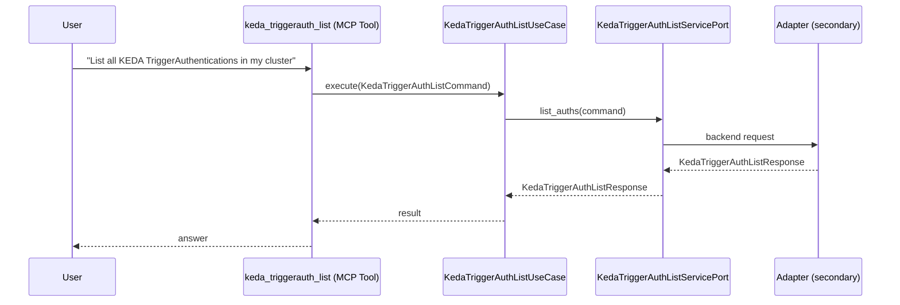

# Use Case 160 — Keda Triggerauth List

## Sample Questions

- "List all KEDA TriggerAuthentications in my cluster"
- "Show me all ClusterTriggerAuthentications"
- "Are there any TriggerAuth objects using pod identity?"
- "Which secrets are referenced by KEDA trigger auths?"
- "List all KEDA auth configurations with their status"

---

"List all KEDA TriggerAuthentications and ClusterTriggerAuthentications — those using pod identity, referenced secrets, and their status. This is the agnostic KEDA auth listing tool; prefer it for generic queries unless the query explicitly mentions AWS, Azure, GCP, IRSA, or Workload Identity." The user asks via keda_triggerauth_list. The flow crosses the hexagonal layers: MCP Tool → KedaTriggerAuthListUseCase → KedaTriggerAuthListServicePort (driven port) → secondary adapter (via adapter_factory) → keda infrastructure.

### Flow 1 — Keda Triggerauth List execution

## Key Points

- `KedaTriggerAuthListUseCase` depends only on `KedaTriggerAuthListServicePort` — never on a cloud SDK.
- Adapter selection is by `adapter_factory`, never hardcoded.
- `{slug}` is registered in `mcp/tools/{slug}.py` and synced to the control-plane cache.

## Related Files

- `src/hexawyn/application/ports/driving/keda_triggerauth_list/keda_triggerauth_list_service_port.py`
- `src/hexawyn/application/use_case/keda/keda_triggerauth_list/keda_triggerauth_list_use_case.py`
- `src/hexawyn/mcp/tools/keda_triggerauth_list.py`

