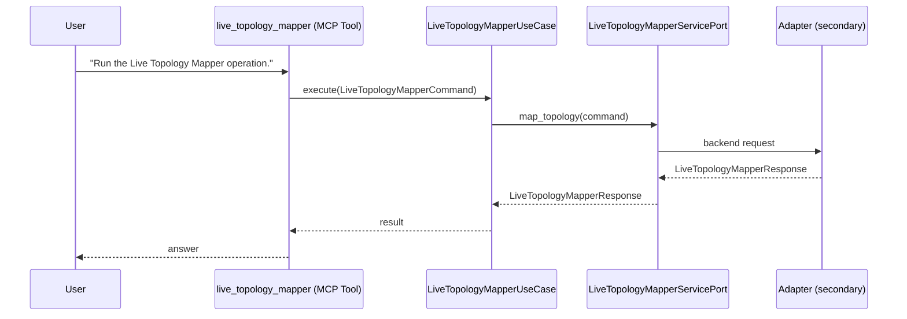

# Use Case 161 — Live Topology Mapper

## Sample Questions

- "Run the Live Topology Mapper operation."

---

"Perform the Live Topology Mapper use case." The user asks via live_topology_mapper. The flow crosses the hexagonal layers: MCP Tool → LiveTopologyMapperUseCase → LiveTopologyMapperServicePort (driven port) → secondary adapter (via adapter_factory) → cluster infrastructure.

### Flow 1 — Live Topology Mapper execution

## Key Points

- `LiveTopologyMapperUseCase` depends only on `LiveTopologyMapperServicePort` — never on a cloud SDK.
- Adapter selection is by `adapter_factory`, never hardcoded.
- `{slug}` is registered in `mcp/tools/{slug}.py` and synced to the control-plane cache.

## Related Files

- `src/hexawyn/application/ports/driving/live_topology_mapper/live_topology_mapper_service_port.py`
- `src/hexawyn/application/use_case/cluster/live_topology_mapper/live_topology_mapper_use_case.py`
- `src/hexawyn/mcp/tools/live_topology_mapper.py`

