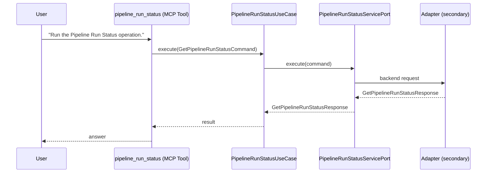

# Use Case 162 — Pipeline Run Status

## Sample Questions

- "Run the Pipeline Run Status operation."

---

"Perform the Pipeline Run Status use case." The user asks via pipeline_run_status. The flow crosses the hexagonal layers: MCP Tool → PipelineRunStatusUseCase → PipelineRunStatusServicePort (driven port) → secondary adapter (via adapter_factory) → pipelines infrastructure.

### Flow 1 — Pipeline Run Status execution

## Key Points

- `PipelineRunStatusUseCase` depends only on `PipelineRunStatusServicePort` — never on a cloud SDK.
- Adapter selection is by `adapter_factory`, never hardcoded.
- `{slug}` is registered in `mcp/tools/{slug}.py` and synced to the control-plane cache.

## Related Files

- `src/hexawyn/application/ports/driving/pipeline_run_status/pipeline_run_status_service_port.py`
- `src/hexawyn/application/use_case/pipelines/pipeline_run_status/pipeline_run_status_use_case.py`
- `src/hexawyn/mcp/tools/pipeline_run_status.py`

