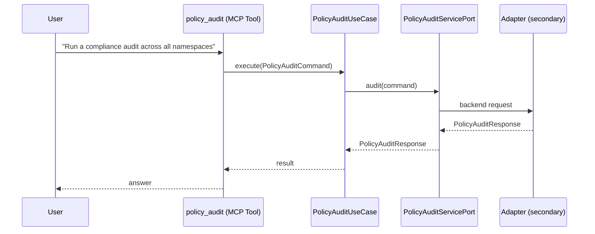

# Use Case 163 — Policy Audit

## Sample Questions

- "Run a compliance audit across all namespaces"
- "Which namespaces have the most policy violations?"
- "Is the production namespace compliant with all policies?"
- "Give me a security compliance report for the entire cluster"
- "How many resources are non-compliant per namespace?"

---

"Run a policy compliance audit across all namespaces, which have the most violations, per-namespace non-compliant resource counts, and a cluster-wide compliance report" The user asks via policy_audit. The flow crosses the hexagonal layers: MCP Tool → PolicyAuditUseCase → PolicyAuditServicePort (driven port) → secondary adapter (via adapter_factory) → governance infrastructure.

### Flow 1 — Policy Audit execution

## Key Points

- `PolicyAuditUseCase` depends only on `PolicyAuditServicePort` — never on a cloud SDK.
- Adapter selection is by `adapter_factory`, never hardcoded.
- `{slug}` is registered in `mcp/tools/{slug}.py` and synced to the control-plane cache.

## Related Files

- `src/hexawyn/application/ports/driving/policy_audit/policy_audit_service_port.py`
- `src/hexawyn/application/use_case/governance/policy_audit/policy_audit_use_case.py`
- `src/hexawyn/mcp/tools/policy_audit.py`

