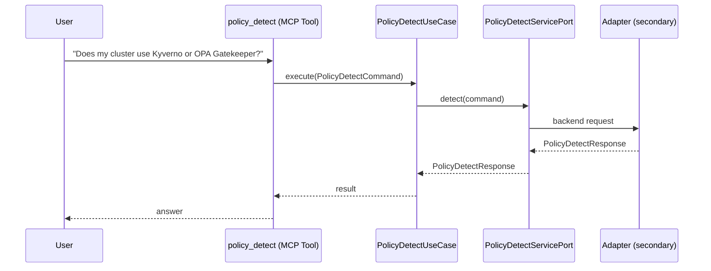

# Use Case 164 — Policy Detect

## Sample Questions

- "Does my cluster use Kyverno or OPA Gatekeeper?"
- "Which policy engine is installed in my cluster?"
- "Are there any policy violations in my cluster right now?"
- "How many enforce vs audit policies do I have?"
- "Detect the policy engine and show me the violation counts"

---

"Detect the policy engine installed (Kyverno or OPA Gatekeeper), current policy violations, and how many enforce versus audit policies exist" The user asks via policy_detect. The flow crosses the hexagonal layers: MCP Tool → PolicyDetectUseCase → PolicyDetectServicePort (driven port) → secondary adapter (via adapter_factory) → governance infrastructure.

### Flow 1 — Policy Detect execution

## Key Points

- `PolicyDetectUseCase` depends only on `PolicyDetectServicePort` — never on a cloud SDK.
- Adapter selection is by `adapter_factory`, never hardcoded.
- `{slug}` is registered in `mcp/tools/{slug}.py` and synced to the control-plane cache.

## Related Files

- `src/hexawyn/application/ports/driving/policy_detect/policy_detect_service_port.py`
- `src/hexawyn/application/use_case/governance/policy_detect/policy_detect_use_case.py`
- `src/hexawyn/mcp/tools/policy_detect.py`

