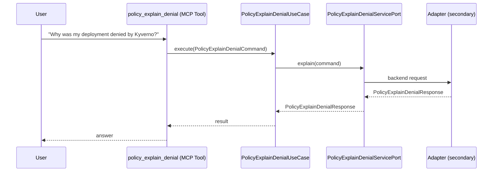

# Use Case 165 — Policy Explain Denial

## Sample Questions

- "Why was my deployment denied by Kyverno?"
- "Explain why my pod was rejected by the policy engine"
- "What do I need to change to pass the security policy?"
- "My nginx deployment was blocked — what rule did it violate?"
- "Give me the fix suggestion for the denied resource in production"

---

"Explain why a deployment or pod was denied by Kyverno or the policy engine, which rule it violated, and what to change to pass" The user asks via policy_explain_denial. The flow crosses the hexagonal layers: MCP Tool → PolicyExplainDenialUseCase → PolicyExplainDenialServicePort (driven port) → secondary adapter (via adapter_factory) → governance infrastructure.

### Flow 1 — Policy Explain Denial execution

## Key Points

- `PolicyExplainDenialUseCase` depends only on `PolicyExplainDenialServicePort` — never on a cloud SDK.
- Adapter selection is by `adapter_factory`, never hardcoded.
- `{slug}` is registered in `mcp/tools/{slug}.py` and synced to the control-plane cache.

## Related Files

- `src/hexawyn/application/ports/driving/policy_explain_denial/policy_explain_denial_service_port.py`
- `src/hexawyn/application/use_case/governance/policy_explain_denial/policy_explain_denial_use_case.py`
- `src/hexawyn/mcp/tools/policy_explain_denial.py`

