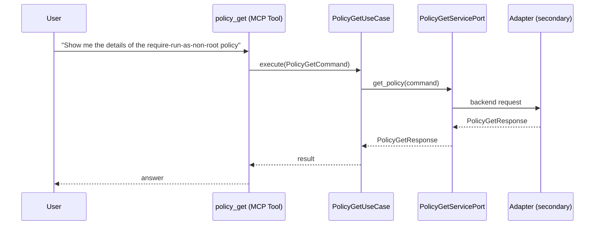

# Use Case 166 — Policy Get

## Sample Questions

- "Show me the details of the require-run-as-non-root policy"
- "How many rules does the deny-latest-tag ClusterPolicy have?"
- "Is the restrict-image-registries Gatekeeper constraint ready?"
- "What is the description and action of this policy?"
- "Get the full configuration of the production security policy"

---

"Get the full configuration of a specific Kyverno ClusterPolicy or Gatekeeper constraint, its rules, action and readiness" The user asks via policy_get. The flow crosses the hexagonal layers: MCP Tool → PolicyGetUseCase → PolicyGetServicePort (driven port) → secondary adapter (via adapter_factory) → governance infrastructure.

### Flow 1 — Policy Get execution

## Key Points

- `PolicyGetUseCase` depends only on `PolicyGetServicePort` — never on a cloud SDK.
- Adapter selection is by `adapter_factory`, never hardcoded.
- `{slug}` is registered in `mcp/tools/{slug}.py` and synced to the control-plane cache.

## Related Files

- `src/hexawyn/application/ports/driving/policy_get/policy_get_service_port.py`
- `src/hexawyn/application/use_case/governance/policy_get/policy_get_use_case.py`
- `src/hexawyn/mcp/tools/policy_get.py`

