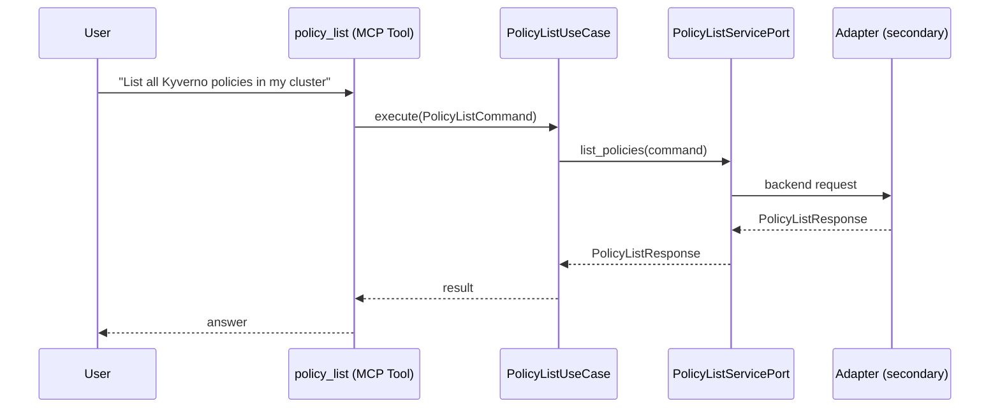

# Use Case 167 — Policy List

## Sample Questions

- "List all Kyverno policies in my cluster"
- "Which policies are in enforce mode vs audit mode?"
- "Show me all ClusterPolicies with their violation counts"
- "What policies are blocking deployments using root containers?"
- "List all Gatekeeper constraints and their readiness status"

---

"List all Kyverno policies and Gatekeeper constraints, which are in enforce versus audit mode, their violation counts and readiness" The user asks via policy_list. The flow crosses the hexagonal layers: MCP Tool → PolicyListUseCase → PolicyListServicePort (driven port) → secondary adapter (via adapter_factory) → governance infrastructure.

### Flow 1 — Policy List execution

## Key Points

- `PolicyListUseCase` depends only on `PolicyListServicePort` — never on a cloud SDK.
- Adapter selection is by `adapter_factory`, never hardcoded.
- `{slug}` is registered in `mcp/tools/{slug}.py` and synced to the control-plane cache.

## Related Files

- `src/hexawyn/application/ports/driving/policy_list/policy_list_service_port.py`
- `src/hexawyn/application/use_case/governance/policy_list/policy_list_use_case.py`
- `src/hexawyn/mcp/tools/policy_list.py`

