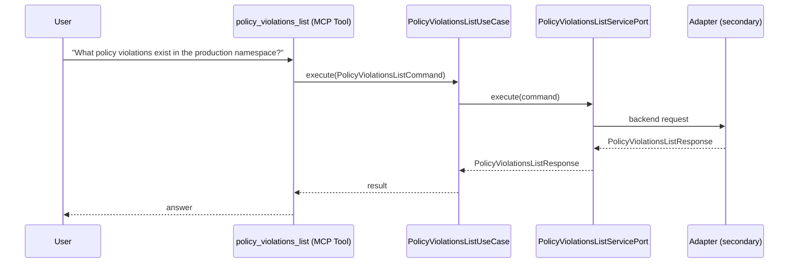

# Use Case 168 — Policy Violations List

## Sample Questions

- "What policy violations exist in the production namespace?"
- "Are there any non-compliant resources in my cluster?"
- "Show me all violations with HIGH severity"
- "Which deployments are violating the no-root policy?"
- "List all policy violations in the default namespace"

---

"List policy violations and non-compliant resources in a namespace, filter by HIGH severity, and find deployments violating specific policies like no-root" The user asks via policy_violations_list. The flow crosses the hexagonal layers: MCP Tool → PolicyViolationsListUseCase → PolicyViolationsListServicePort (driven port) → secondary adapter (via adapter_factory) → governance infrastructure.

### Flow 1 — Policy Violations List execution

## Key Points

- `PolicyViolationsListUseCase` depends only on `PolicyViolationsListServicePort` — never on a cloud SDK.
- Adapter selection is by `adapter_factory`, never hardcoded.
- `{slug}` is registered in `mcp/tools/{slug}.py` and synced to the control-plane cache.

## Related Files

- `src/hexawyn/application/ports/driving/policy_violations_list/policy_violations_list_service_port.py`
- `src/hexawyn/application/use_case/governance/policy_violations_list/policy_violations_list_use_case.py`
- `src/hexawyn/mcp/tools/policy_violations_list.py`

