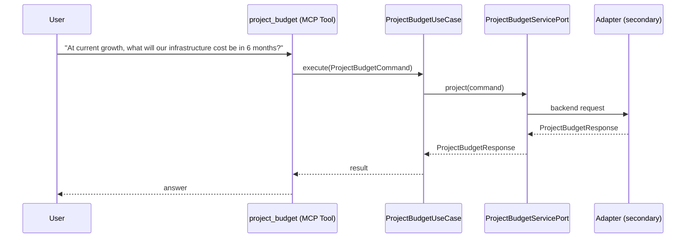

# Use Case 169 — Project Budget

## Sample Questions

- "At current growth, what will our infrastructure cost be in 6 months?"
- "Project our monthly cloud spend for the next two quarters with best and worst case."
- "When will we exceed our monthly budget threshold at the current growth rate?"
- "Is our infrastructure cost trending up or down, and by how much per month?"
- "Give me a 6-month budget forecast broken down by compute, storage and network."
- "Forecast our cloud bill so I can plan the budget and avoid surprises."

---

"6-MONTH LONG-TERM PROJECTION: project infrastructure cost 6 months ahead with best and worst case scenarios. Shows when budget threshold will be exceeded, broken down by compute/storage/network. Answers: "what will we spend in Q3", "at current growth when do we hit the budget cap". This is for LONG-TERM PLANNING (quarters/years), not this month's tracking. Do NOT use for: this month's spend (use forecast_cost), immediate budget check (use compute_budget_intelligence), finding waste (use detect_over_provisioned_namespaces).
" The user asks via project_budget. The flow crosses the hexagonal layers: MCP Tool → ProjectBudgetUseCase → ProjectBudgetServicePort (driven port) → secondary adapter (via adapter_factory) → finops infrastructure.

### Flow 1 — Project Budget execution

## Key Points

- `ProjectBudgetUseCase` depends only on `ProjectBudgetServicePort` — never on a cloud SDK.
- Adapter selection is by `adapter_factory`, never hardcoded.
- `{slug}` is registered in `mcp/tools/{slug}.py` and synced to the control-plane cache.

## Related Files

- `src/hexawyn/application/ports/driving/project_budget/project_budget_service_port.py`
- `src/hexawyn/application/use_case/finops/project_budget/project_budget_use_case.py`
- `src/hexawyn/mcp/tools/project_budget.py`

