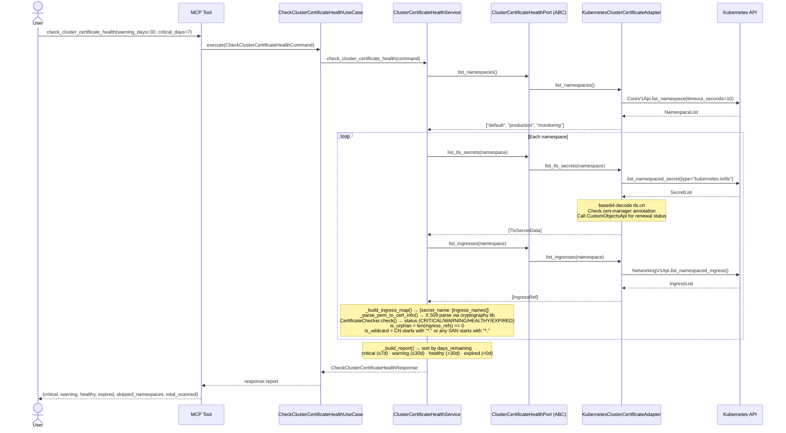
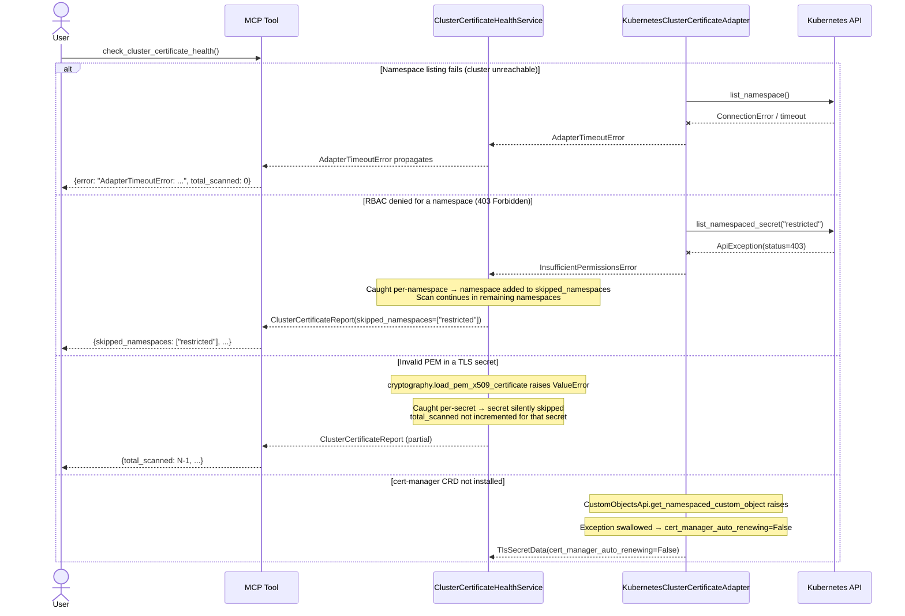
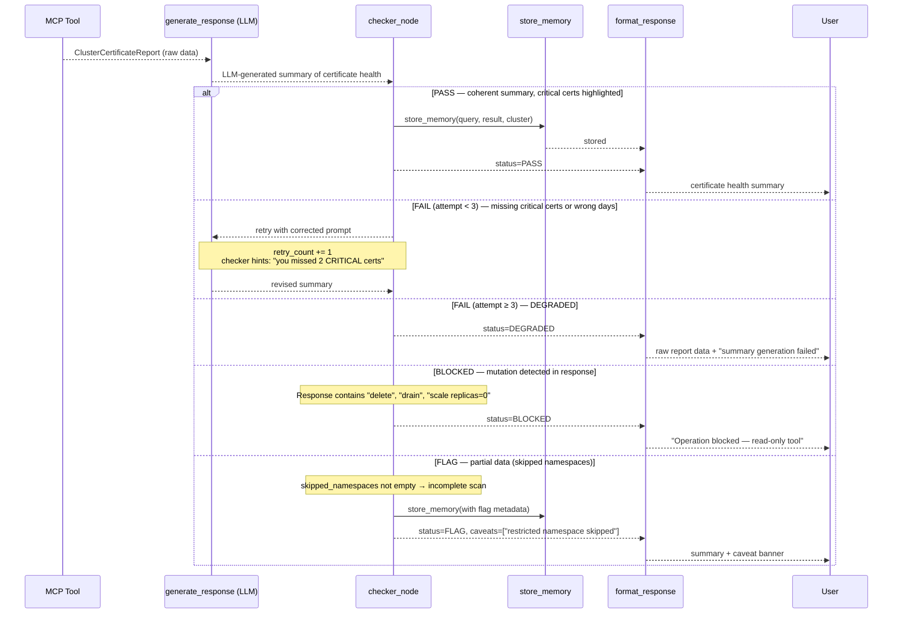

# Use Case 17 — Check Cluster Certificate Health

## Sample Questions

- "Which TLS certificates in the cluster are expiring soon?"
- "Are any certificates going to expire in the next 7 days?"
- "Show me all expired certificates across all namespaces"
- "Which TLS secrets are not referenced by any ingress — orphaned certs?"
- "Is cert-manager managing the renewal of my production certificates?"

---

## Happy Path

---

## Error Flows

---

## Checker Node — Response Quality Validation

---

## Key Points

- **Per-namespace RBAC resilience** — a single 403 on a namespace adds it to `skipped_namespaces` and the scan continues; no crash, no partial silence.
- **cert-manager auto-renewal detection** — the adapter checks the Certificate CR status via `CustomObjectsApi`; `Ready=False` means a renewal is in flight; exceptions are swallowed so non-cert-manager clusters work unchanged.
- **Orphan detection** — `is_orphan=True` when no Ingress references the secret, helping clean up abandoned TLS secrets.
- **Wildcard detection** — CN or any SAN starting with `*.` sets `is_wildcard=True` on the entry.
- **Sorted buckets** — critical/warning/healthy/expired each sorted ascending by `days_remaining` so the most urgent certificates appear first.

## Test Coverage

| Test | Scenario |
|------|----------|
| `TestCheckClusterCertificateHealthCommand::test_defaults` | Default thresholds (30d/7d/10s) |
| `TestCheckClusterCertificateHealthCommand::test_is_frozen` | Command is immutable |
| `TestClusterCertificateHealthService::test_happy_path_healthy_cert` | Single healthy cert → 1 in healthy bucket |
| `TestClusterCertificateHealthService::test_critical_cert_classified_correctly` | 3d remaining → CRITICAL |
| `TestClusterCertificateHealthService::test_warning_cert_classified_correctly` | 20d remaining → WARNING |
| `TestClusterCertificateHealthService::test_expired_cert_classified_correctly` | -5d → EXPIRED |
| `TestClusterCertificateHealthService::test_cert_with_ingress_ref_not_orphan` | Ingress references secret → is_orphan=False |
| `TestClusterCertificateHealthService::test_cert_without_ingress_ref_is_orphan` | No ingress → is_orphan=True |
| `TestClusterCertificateHealthService::test_rbac_blocked_namespace_skipped` | 403 namespace → skipped_namespaces populated |
| `TestKubernetesAdapterHelpers::test_list_tls_secrets_rbac_403_raises` | RBAC 403 → InsufficientPermissionsError |
| `TestKubernetesAdapterHelpers::test_list_tls_secrets_non_403_error_reraises` | Non-403 exception → re-raised |
| `TestKubernetesAdapterHelpers::test_is_auto_renewing_cert_not_ready_returns_true` | CR Ready=False → auto_renewing=True |
| `TestKubernetesAdapterHelpers::test_is_auto_renewing_api_error_returns_false` | CRD not installed → False (no crash) |
| `TestParsePemToCertInfo::test_cert_with_san_extension_populates_san_list` | SAN extension parsed correctly |
| `TestCheckClusterCertificateHealthMCPTool::test_tool_error_returns_error_key` | Exception → error key in result |

## Related Files

- `src/hexawyn/domain/models/certificate.py` — `CertificateEntry`, `ClusterCertificateReport`, `CertificateInfo`
- `src/hexawyn/domain/services/certificate/checker.py` — `CertificateChecker` (EXPIRED/CRITICAL/WARNING/HEALTHY)
- `src/hexawyn/application/ports/driven/cluster_certificate_health_port.py` — `ClusterCertificateHealthPort` ABC, `TlsSecretData`, `IngressRef`
- `src/hexawyn/application/ports/driving/check_cluster_certificate_health/` — command, response, service port ABC
- `src/hexawyn/application/service/cluster_certificate_health_service.py` — full service with PEM parsing + report building
- `src/hexawyn/application/use_case/check_cluster_certificate_health/check_cluster_certificate_health_use_case.py` — thin use case
- `src/hexawyn/adapters/secondary/kubernetes_cluster_certificate_adapter.py` — K8s adapter (secrets, ingresses, cert-manager CR)
- `src/hexawyn/mcp/tools/check_cluster_certificate_health.py` — MCP tool registration + serialization
- `tests/unit/test_check_cluster_certificate_health_use_case.py` — 69 unit tests
