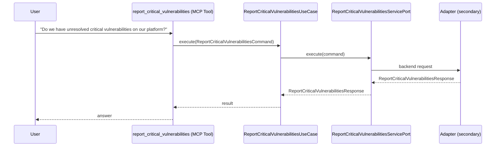

# Use Case 170 — Report Critical Vulnerabilities

## Sample Questions

- "Do we have unresolved critical vulnerabilities on our platform?"
- "How many critical CVEs are still open, and on which services?"
- "What is the oldest unresolved critical vulnerability?"
- "Do we have unresolved critical vulnerabilities on our platform?"
- "How many critical CVEs are still open, and on which services?"
- "What is the oldest unresolved critical vulnerability?"

---

"Report unresolved critical CVEs and vulnerabilities across the platform, how many are still open and on which services, and the oldest unresolved one" The user asks via report_critical_vulnerabilities. The flow crosses the hexagonal layers: MCP Tool → ReportCriticalVulnerabilitiesUseCase → ReportCriticalVulnerabilitiesServicePort (driven port) → secondary adapter (via adapter_factory) → security infrastructure.

### Flow 1 — Report Critical Vulnerabilities execution

## Key Points

- `ReportCriticalVulnerabilitiesUseCase` depends only on `ReportCriticalVulnerabilitiesServicePort` — never on a cloud SDK.
- Adapter selection is by `adapter_factory`, never hardcoded.
- `{slug}` is registered in `mcp/tools/{slug}.py` and synced to the control-plane cache.

## Related Files

- `src/hexawyn/application/ports/driving/report_critical_vulnerabilities/report_critical_vulnerabilities_service_port.py`
- `src/hexawyn/application/use_case/security/report_critical_vulnerabilities/report_critical_vulnerabilities_use_case.py`
- `src/hexawyn/mcp/tools/report_critical_vulnerabilities.py`

