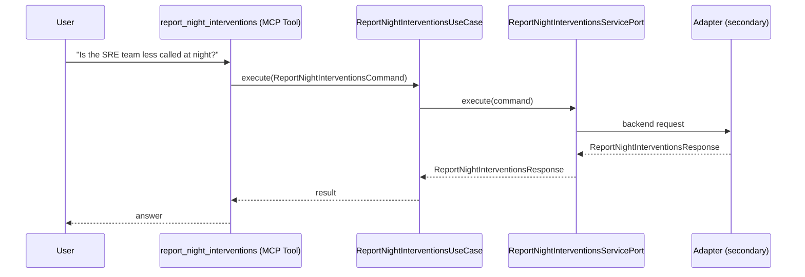

# Use Case 171 — Report Night Interventions

## Sample Questions

- "Is the SRE team less called at night?"
- "How many night interventions do we have this month vs last quarter?"
- "Is our on-call nighttime load improving?"
- "What is the average number of interventions per night this month?"
- "Is the SRE team less called at night?"
- "How many night interventions do we have this month vs last quarter?"
- "Is our on-call nighttime load improving?"

---

"Report after-hours and nighttime on-call interventions, how many this month versus last quarter, whether the SRE night load is improving, and average interventions per night" The user asks via report_night_interventions. The flow crosses the hexagonal layers: MCP Tool → ReportNightInterventionsUseCase → ReportNightInterventionsServicePort (driven port) → secondary adapter (via adapter_factory) → workloads infrastructure.

### Flow 1 — Report Night Interventions execution

## Key Points

- `ReportNightInterventionsUseCase` depends only on `ReportNightInterventionsServicePort` — never on a cloud SDK.
- Adapter selection is by `adapter_factory`, never hardcoded.
- `{slug}` is registered in `mcp/tools/{slug}.py` and synced to the control-plane cache.

## Related Files

- `src/hexawyn/application/ports/driving/report_night_interventions/report_night_interventions_service_port.py`
- `src/hexawyn/application/use_case/workloads/report_night_interventions/report_night_interventions_use_case.py`
- `src/hexawyn/mcp/tools/report_night_interventions.py`

