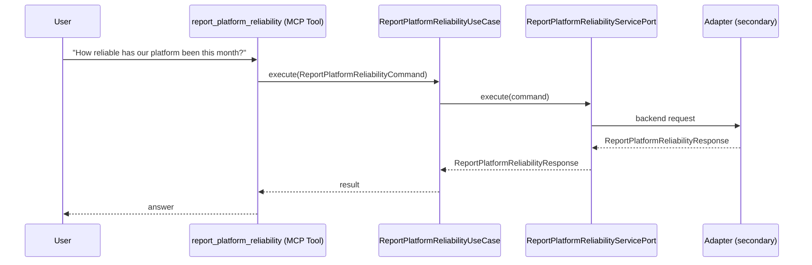

# Use Case 172 — Report Platform Reliability

## Sample Questions

- "How reliable has our platform been this month?"
- "How many incidents did we have this month, and what severity?"
- "Is our resolution time improving compared to last month?"
- "What was the financial impact of downtime this month?"
- "Give me a platform health summary in plain language for management."
- "How reliable was our platform this month in plain business terms?"
- "What's our platform uptime this month versus last month?"
- "How many incidents did we have this month, and what severity?"

---

"Report platform reliability and uptime this month in plain business terms, incident count and severity, resolution time trend, and the financial impact of downtime" The user asks via report_platform_reliability. The flow crosses the hexagonal layers: MCP Tool → ReportPlatformReliabilityUseCase → ReportPlatformReliabilityServicePort (driven port) → secondary adapter (via adapter_factory) → workloads infrastructure.

### Flow 1 — Report Platform Reliability execution

## Key Points

- `ReportPlatformReliabilityUseCase` depends only on `ReportPlatformReliabilityServicePort` — never on a cloud SDK.
- Adapter selection is by `adapter_factory`, never hardcoded.
- `{slug}` is registered in `mcp/tools/{slug}.py` and synced to the control-plane cache.

## Related Files

- `src/hexawyn/application/ports/driving/report_platform_reliability/report_platform_reliability_service_port.py`
- `src/hexawyn/application/use_case/workloads/report_platform_reliability/report_platform_reliability_use_case.py`
- `src/hexawyn/mcp/tools/report_platform_reliability.py`

