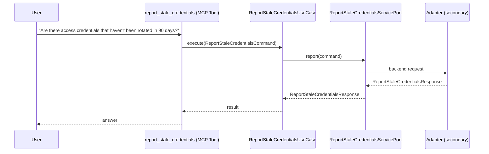

# Use Case 173 — Report Stale Credentials

## Sample Questions

- "Are there access credentials that haven't been rotated in 90 days?"
- "How many credentials are overdue for rotation, and which are critical?"
- "Which secrets should we rotate this week for compliance?"
- "Are there access credentials that haven't been rotated in 90 days?"
- "How many credentials are overdue for rotation, and which are critical?"
- "Which secrets should we rotate this week for compliance?"

---

"Report access credentials and secrets not rotated in 90 days, how many are overdue and which are critical, and which to rotate this week for compliance" The user asks via report_stale_credentials. The flow crosses the hexagonal layers: MCP Tool → ReportStaleCredentialsUseCase → ReportStaleCredentialsServicePort (driven port) → secondary adapter (via adapter_factory) → security infrastructure.

### Flow 1 — Report Stale Credentials execution

## Key Points

- `ReportStaleCredentialsUseCase` depends only on `ReportStaleCredentialsServicePort` — never on a cloud SDK.
- Adapter selection is by `adapter_factory`, never hardcoded.
- `{slug}` is registered in `mcp/tools/{slug}.py` and synced to the control-plane cache.

## Related Files

- `src/hexawyn/application/ports/driving/report_stale_credentials/report_stale_credentials_service_port.py`
- `src/hexawyn/application/use_case/security/report_stale_credentials/report_stale_credentials_use_case.py`
- `src/hexawyn/mcp/tools/report_stale_credentials.py`

