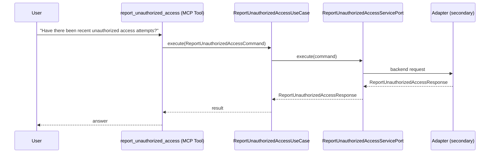

# Use Case 174 — Report Unauthorized Access

## Sample Questions

- "Have there been recent unauthorized access attempts?"
- "What is the alert level on blocked access attempts?"
- "Where are the blocked access attempts coming from?"
- "Have there been recent unauthorized access attempts?"
- "What is the alert level on blocked access attempts?"
- "Where are the blocked access attempts coming from?"

---

"Report recent unauthorized or blocked access attempts, the current alert level, and where the blocked attempts are coming from" The user asks via report_unauthorized_access. The flow crosses the hexagonal layers: MCP Tool → ReportUnauthorizedAccessUseCase → ReportUnauthorizedAccessServicePort (driven port) → secondary adapter (via adapter_factory) → security infrastructure.

### Flow 1 — Report Unauthorized Access execution

## Key Points

- `ReportUnauthorizedAccessUseCase` depends only on `ReportUnauthorizedAccessServicePort` — never on a cloud SDK.
- Adapter selection is by `adapter_factory`, never hardcoded.
- `{slug}` is registered in `mcp/tools/{slug}.py` and synced to the control-plane cache.

## Related Files

- `src/hexawyn/application/ports/driving/report_unauthorized_access/report_unauthorized_access_service_port.py`
- `src/hexawyn/application/use_case/security/report_unauthorized_access/report_unauthorized_access_use_case.py`
- `src/hexawyn/mcp/tools/report_unauthorized_access.py`

