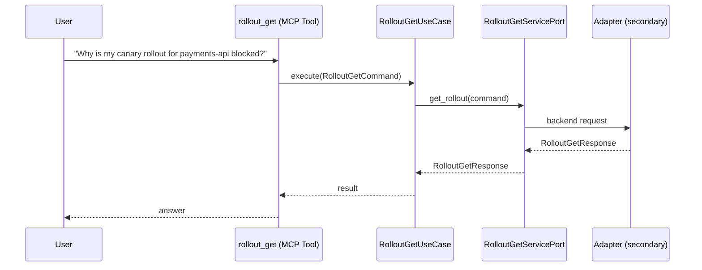

# Use Case 175 — Rollout Get

## Sample Questions

- "Why is my canary rollout for payments-api blocked?"
- "Get the full status of the auth-service rollout with step details"
- "What is the current canary weight for the checkout rollout?"
- "Show me the AnalysisRun linked to the production rollout"
- "What is the current image being rolled out for the frontend service?"

---

"Get the full status of an Argo Rollout with step detail, why a canary is blocked, current canary weight, linked AnalysisRun, and the image being rolled out" The user asks via rollout_get. The flow crosses the hexagonal layers: MCP Tool → RolloutGetUseCase → RolloutGetServicePort (driven port) → secondary adapter (via adapter_factory) → workloads infrastructure.

### Flow 1 — Rollout Get execution

## Key Points

- `RolloutGetUseCase` depends only on `RolloutGetServicePort` — never on a cloud SDK.
- Adapter selection is by `adapter_factory`, never hardcoded.
- `{slug}` is registered in `mcp/tools/{slug}.py` and synced to the control-plane cache.

## Related Files

- `src/hexawyn/application/ports/driving/rollout_get/rollout_get_service_port.py`
- `src/hexawyn/application/use_case/workloads/rollout_get/rollout_get_use_case.py`
- `src/hexawyn/mcp/tools/rollout_get.py`

