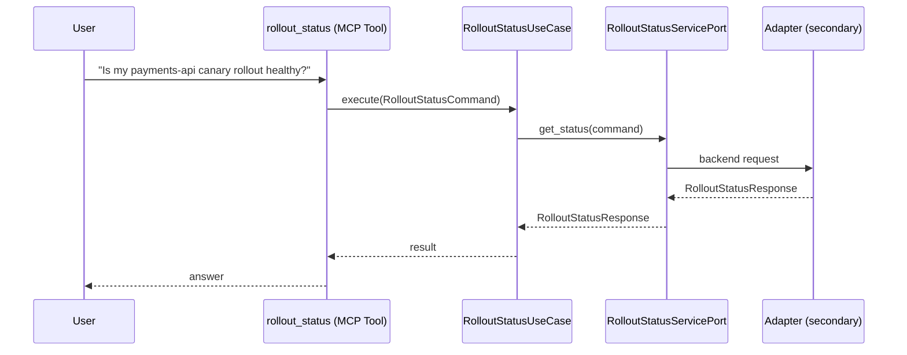

# Use Case 176 — Rollout Status

## Sample Questions

- "Is my payments-api canary rollout healthy?"
- "What step is the checkout rollout on and what is the canary weight?"
- "Why is the auth-service rollout paused?"
- "Should I promote or abort the current rollout of the api-gateway?"
- "Show me the real-time status of the production deployment rollout"

---

"Get the real-time status of an Argo Rollout, which step and canary weight it is on, why it is paused, and whether to promote or abort" The user asks via rollout_status. The flow crosses the hexagonal layers: MCP Tool → RolloutStatusUseCase → RolloutStatusServicePort (driven port) → secondary adapter (via adapter_factory) → workloads infrastructure.

### Flow 1 — Rollout Status execution

## Key Points

- `RolloutStatusUseCase` depends only on `RolloutStatusServicePort` — never on a cloud SDK.
- Adapter selection is by `adapter_factory`, never hardcoded.
- `{slug}` is registered in `mcp/tools/{slug}.py` and synced to the control-plane cache.

## Related Files

- `src/hexawyn/application/ports/driving/rollout_status/rollout_status_service_port.py`
- `src/hexawyn/application/use_case/workloads/rollout_status/rollout_status_use_case.py`
- `src/hexawyn/mcp/tools/rollout_status.py`

