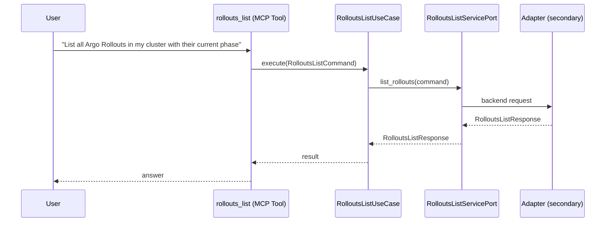

# Use Case 177 — Rollouts List

## Sample Questions

- "List all Argo Rollouts in my cluster with their current phase"
- "Are there any rollouts in progress right now?"
- "Show me all canary rollouts in the production namespace"
- "Which rollouts are currently paused or degraded?"
- "List all blue-green rollouts with their stable and canary images"

---

"List all Argo Rollouts with their phase, canary and blue-green rollouts, stable and canary images, and which are paused or degraded" The user asks via rollouts_list. The flow crosses the hexagonal layers: MCP Tool → RolloutsListUseCase → RolloutsListServicePort (driven port) → secondary adapter (via adapter_factory) → workloads infrastructure.

### Flow 1 — Rollouts List execution

## Key Points

- `RolloutsListUseCase` depends only on `RolloutsListServicePort` — never on a cloud SDK.
- Adapter selection is by `adapter_factory`, never hardcoded.
- `{slug}` is registered in `mcp/tools/{slug}.py` and synced to the control-plane cache.

## Related Files

- `src/hexawyn/application/ports/driving/rollouts_list/rollouts_list_service_port.py`
- `src/hexawyn/application/use_case/workloads/rollouts_list/rollouts_list_use_case.py`
- `src/hexawyn/mcp/tools/rollouts_list.py`

