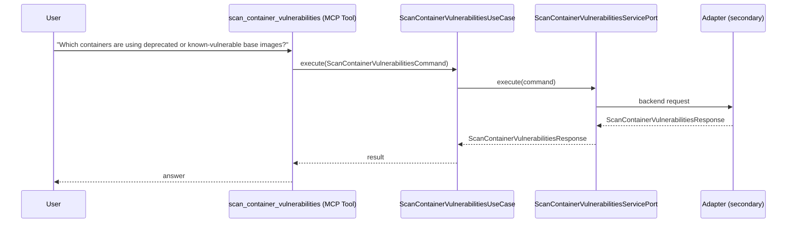

# Use Case 178 — Scan Container Vulnerabilities

## Sample Questions

- "Which containers are using deprecated or known-vulnerable base images?"
- "Does payment:v1.2 have any Critical CVEs, and is there a fix version available?"
- "Are we running any images with an end-of-life base image?"
- "Which Critical CVEs in production should we patch first?"
- "How many of our running images are actually affected by known vulnerabilities?"
- "Are any of our images running on a mutable latest tag?"

---

"Scan container images for known CVEs and vulnerable or end-of-life base images, which Critical CVEs to patch first, and how many running images are affected" The user asks via scan_container_vulnerabilities. The flow crosses the hexagonal layers: MCP Tool → ScanContainerVulnerabilitiesUseCase → ScanContainerVulnerabilitiesServicePort (driven port) → secondary adapter (via adapter_factory) → security infrastructure.

### Flow 1 — Scan Container Vulnerabilities execution

## Key Points

- `ScanContainerVulnerabilitiesUseCase` depends only on `ScanContainerVulnerabilitiesServicePort` — never on a cloud SDK.
- Adapter selection is by `adapter_factory`, never hardcoded.
- `{slug}` is registered in `mcp/tools/{slug}.py` and synced to the control-plane cache.

## Related Files

- `src/hexawyn/application/ports/driving/scan_container_vulnerabilities/scan_container_vulnerabilities_service_port.py`
- `src/hexawyn/application/use_case/security/scan_container_vulnerabilities/scan_container_vulnerabilities_use_case.py`
- `src/hexawyn/mcp/tools/scan_container_vulnerabilities.py`

