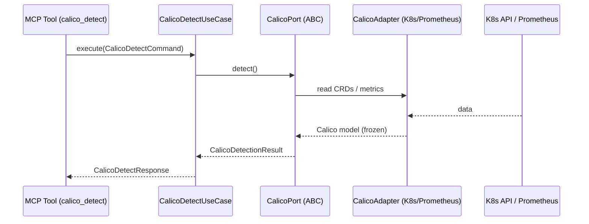

# Use Case 179 — Calico Detect

## Sample Questions

- "Is Calico installed on this cluster and what version is running?"
- "Which dataplane mode is Calico using, IPIP, VXLAN or eBPF?"
- "Are the calico-node agents healthy on every node?"
- "Is Calico the active CNI or is something else in charge?"
- "Is any calico-node agent degraded or not ready right now?"
- "Is tigera-operator (Calico Enterprise) detected on this cluster?"

---

"Detect whether Calico is the active CNI and report its version, dataplane mode, and per-node calico-node agent health with a degradation summary." The user asks via `calico_detect`. The flow crosses the hexagonal layers: MCP Tool → `CalicoDetectUseCase` → `CalicoPort` (driven port) → `CalicoK8sAdapter` / `CalicoPrometheusAdapter` (secondary adapters) → Kubernetes API / Prometheus.

### Flow 1 — Calico Detect execution

## Key Points

- `CalicoDetectUseCase` depends only on `CalicoPort` — never on a Kubernetes SDK.
- `CalicoK8sAdapter` translates every failure to a `HexawynError` subclass and emits an honest `NOT_INSTALLED` marker when Calico is absent (never a fabricated value).
- Dataplane mode (IPIP / VXLAN / eBPF / UNKNOWN) and the degraded summary are computed by the pure domain service, keeping the adapter thin.
- `calico_detect` is registered in `mcp/tools/calico_detect.py` and synced to the control-plane cache.

## Related Files

- `src/hexawyn/domain/models/calico.py`
- `src/hexawyn/domain/services/calico/detection_service.py`
- `src/hexawyn/application/ports/driven/calico_port.py`
- `src/hexawyn/application/use_case/calico/calico_detect/calico_detect_use_case.py`
- `src/hexawyn/adapters/secondary/calico/calico_k8s_adapter.py`
- `src/hexawyn/adapters/secondary/calico/calico_prometheus_adapter.py`
- `src/hexawyn/mcp/adapters/calico_adapters.py`
- `src/hexawyn/mcp/tools/calico_detect.py`
