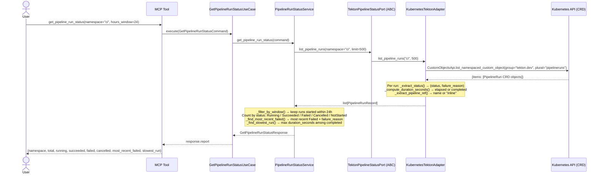
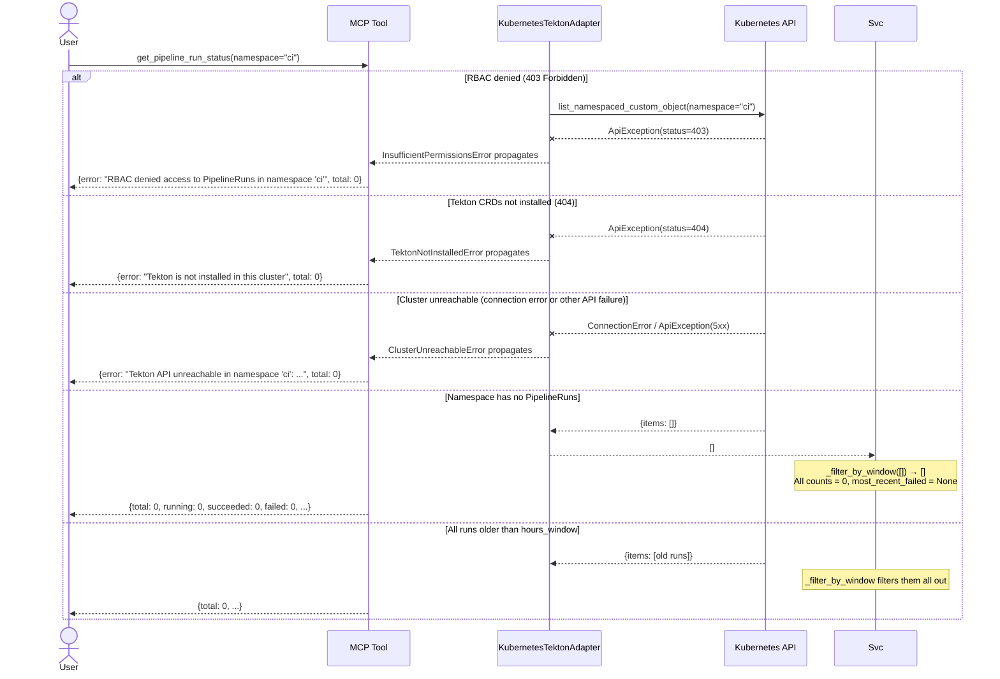
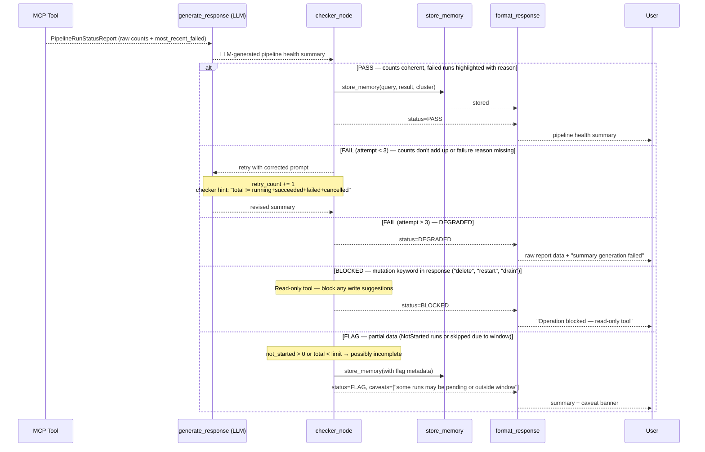

# Use Case 18 — Get Pipeline Run Status

## Sample Questions

- "What is the current status of all Tekton PipelineRuns in the CI namespace?"
- "How many builds succeeded or failed in the last 24 hours?"
- "Which pipeline run took the longest to complete today?"
- "Show me the most recent failed build and why it failed"
- "Are there any stuck or pending pipeline runs in ci?"

---

## Happy Path

---

## Error Flows

---

## Checker Node — Response Quality Validation

---

## Key Points

- **Time-window filtering** — only runs started within `hours_window` (default 24h) are counted; runs with no `start_time` (NotStarted/Pending) are always included.
- **Elapsed time for running** — `duration_seconds` is computed as `now - start_time` for in-progress runs, giving live elapsed time without waiting for completion.
- **Failure reason surfacing** — the adapter extracts the Tekton condition `reason` field (e.g., `TaskRunTimeout`, `TaskRunImagePullFailed`) so engineers can act immediately without browsing the Tekton dashboard.
- **Slowest run** — computed across all completed (Succeeded + Failed) runs within the window; useful for detecting regressions in build time.
- **Graceful Tekton-absent handling** — `TektonNotInstalledError` on 404 gives a clear message instead of a raw API error.

## Test Coverage

| Test | Scenario |
|------|----------|
| `TestPipelineRunStatusService::test_happy_path_mixed_statuses` | 2 Succeeded, 1 Running, 2 Failed → correct counts |
| `TestPipelineRunStatusService::test_no_pipeline_runs_returns_empty_summary` | No runs → all zeros |
| `TestPipelineRunStatusService::test_all_runs_older_than_window_returns_empty` | 30h old runs excluded from 24h window |
| `TestPipelineRunStatusService::test_failed_run_failure_reason_surfaced` | TaskRunTimeout reason returned |
| `TestPipelineRunStatusService::test_slowest_run_identified` | Longest duration_seconds selected |
| `TestPipelineRunStatusService::test_cancelled_runs_counted` | Cancelled counted separately |
| `TestPipelineRunStatusService::test_custom_hours_window_applied` | 2h window excludes 3h old run |
| `TestPipelineRunStatusService::test_rbac_error_propagates` | InsufficientPermissionsError bubbles |
| `TestKubernetesTektonAdapter::test_list_pipeline_runs_403_raises_insufficient_permissions` | 403 → InsufficientPermissionsError |
| `TestKubernetesTektonAdapter::test_list_pipeline_runs_404_raises_tekton_not_installed` | 404 → TektonNotInstalledError |
| `TestKubernetesTektonAdapter::test_failure_reason_extracted_for_failed_run` | reason="TaskRunTimeout" extracted |
| `TestKubernetesTektonAdapter::test_running_run_has_elapsed_duration` | duration_seconds ≥ 0 for running |
| `TestFilterByWindow::test_includes_pending_run_with_no_start_time` | None start_time → included |
| `TestFilterByWindow::test_invalid_timestamp_excluded` | Malformed timestamp → excluded |
| `TestGetPipelineRunStatusMCPTool::test_tool_error_returns_error_key` | Exception → error key in result |

## Related Files

- `src/hexawyn/domain/models/pipeline.py` — `PipelineRunSummary`, `PipelineRunStatusReport`
- `src/hexawyn/application/ports/driven/tekton_pipeline_status_port.py` — `PipelineRunRecord` TypedDict + `TektonPipelineStatusPort` ABC
- `src/hexawyn/application/ports/driving/get_pipeline_run_status/` — command, response, service port ABC
- `src/hexawyn/application/service/pipeline_run_status_service.py` — window filter, aggregation, most_recent_failed, slowest
- `src/hexawyn/application/use_case/get_pipeline_run_status/get_pipeline_run_status_use_case.py` — thin use case
- `src/hexawyn/adapters/secondary/kubernetes_tekton_adapter.py` — K8s CRD fetch, status/failure_reason/duration extraction
- `src/hexawyn/mcp/tools/get_pipeline_run_status.py` — MCP tool registration + serialization
- `tests/unit/test_get_pipeline_run_status.py` — 59 unit tests
